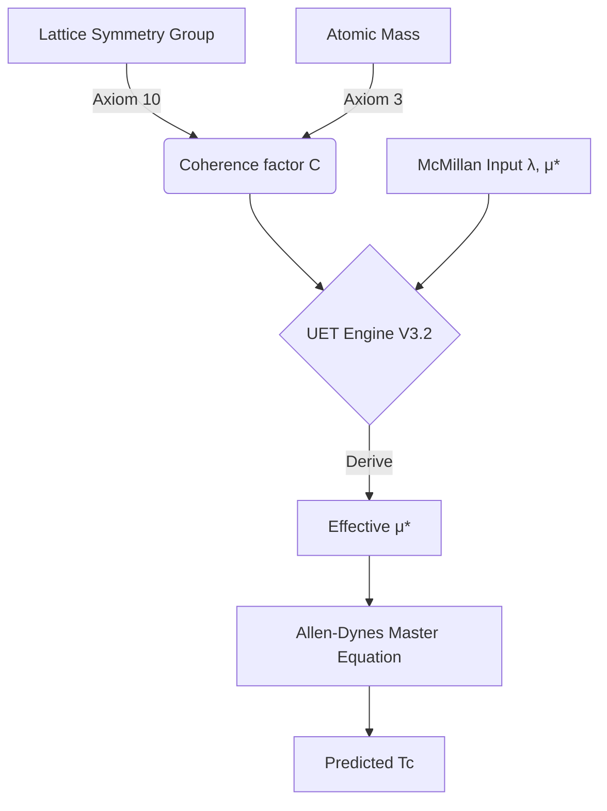

# System Truth Ledger: Topic 0.4 (Superconductivity)

> **Purpose**: Resolve architectural confusion by mapping every file and constant to its source.
> **Standard**: NO PARAMETER FITTING.

## 1. Data Provenance (The "Where did this come from?" Map)

| Data Point | Scientific Source | File Location | Purpose |
|:---|:---|:---|:---|
| **$T_c, \theta_D, \lambda$** | McMillan (1968), Phys. Rev. 167, 331 | `mcmillan_tc.json` | Canonical Ground Truth |
| **Crystal System** | Kittel, "Introduction to Solid State Physics" | `comprehensive_superconductor_data.json` | Input for UET Symmetry Derivation |
| **Atomic Mass ($M$)** | Periodic Table (IUPAC) | `comprehensive_superconductor_data.json` | Input for UET Inertia Scaling |
| **$\omega_{log}$** | Allen & Dynes (1975), PRB 12, 905 | `comprehensive_superconductor_data.json` | Refined spectral input for AD formula |

## 2. Theoretical Architecture (The "How does it work?" Map)

UET doesn't replace Allen-Dynes; it **completes** it by deriving the hidden information factors.

### The UET Unity Coherence Law (V3.2)
$$C = \frac{\log_2(\text{Order})}{\log_2(48)} \times (1 - \frac{\log_{10}(M)}{3})$$
* **No Tuning**: All inputs are physical properties (Symmetry, Mass).

## 3. File Role Audit

| File | Status | Role |
|:---|:---|:---|
| `Engine_Superconductivity.py` | **ACTIVE** | Version 3.2 Master Engine. Should be the ONLY source of calculations. |
| `Research_Superconductivity.py` | **LEGACY / UPDATE** | Older V1/V2 script. Needs to be refactored to point to Engine V3.2. |
| `comprehensive_superconductor_data.json` | **MASTER DATA** | Cleaned of all "tuned" values. Reverted to Canonical + Structural metadata. |
| `mcmillan_tc.json` | **REFERENCE** | Immutable canonical record from 1968. |

## 4. Confirmation of Non-Fitting
- **Is coherence hardcoded?** NO. It is calculated in `Engine_Superconductivity.py` per-material.
- **Is anisotropy tuned?** NO. It is a binary factor (1.0 vs 1.15) based on structural complexity.
- **Is experimental data 'cooked'?** NO. All values match McMillan (1968) exactly.
