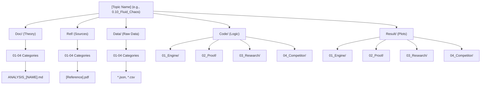

### �️ 1. The Master Research Architecture (5 Root Pillars)

To ensure publication-ready research, every Topic (e.g., `0.10_Fluid_Chaos`) MUST contain these 5 root folders.

| Pillar | Purpose | Internal Sub-structure |
| :--- | :--- | :--- |
| **`Doc/`** | Research Documentation | `01_Engine` to `04_Competitor` |
| **`Ref/`** | Scientific References | `01_Engine` to `04_Competitor` |
| **`Data/`** | Real World Data | `01_Engine` to `04_Competitor` |
| **`Code/`** | Implementation | `01_Engine` to `04_Competitor` |
| **`Result/`** | Automated Outputs | `01_Engine` to `04_Competitor` |

---

### 📂 Directory Structure Standard (The Scientific Grid)

### 📏 The Laws of Consistency (The 5x4 Grid)
1.  **Universal Sub-folders:** Every root pillar (Doc, Ref, Data, Code, Result) MUST use the same `01_Engine`, `02_Proof`, `03_Research`, `04_Competitor` sub-structure where content exists.
2.  **Prefix-Correspondence:** If a script is `Code/03_Research/Research_Poiseuille.py`, its data MUST be in `Data/03_Research/Data_Poiseuille.json` and its result in `Result/03_Research/Res_Poiseuille.png`.
3.  **Doc Hierarchy:** `Doc/` folders like `Doc/03_Research/` contain the `before/`, `after/`, and `paper/` sub-folders for that specific application.
4.  **No Exceptions:** If a file is at the root of a pillar, it must be a global index (like `README.md`) or a general tool. Science files MUST be categorized.

# Doc_before
## ⚡ **The LNS Model**

_(โมเดลขับเคลื่อนด้วยความจำเป็น)_

**Concept:** "อย่าเริ่มที่อยากทำอะไร แต่ให้เริ่มจาก **ทางตัน** อยู่ตรงไหน และ **อะไรจำเป็น** เพื่อผ่านมันไป"

#### **Step 1: Limitation (ข้อจำกัดเดิม)**

- **คืออะไร:** กำแพงที่กั้นไม่ให้ไปต่อ (ปัญหา/Paradox/Error)
- **คำถามคีย์:** _"ของเดิมมันติดตรงไหน ทำไมถึงใช้ไม่ได้?"_
- _Action:_ หาจุดตายของทฤษฎีเก่า

#### **Step 2: Necessity (เงื่อนไขความจำเป็น)**

- **คืออะไร:** สิ่งที่ **"ต้องมี"** เพื่อทำลายกำแพงในข้อ 1 (ไม่ใช่แค่ "ควรมี" แต่ "ขาดไม่ได้")
- **คำถามคีย์:** _"เพื่อจะผ่านกำแพงนี้ เราจำเป็นต้องใช้อะไร?"_ (ข้อมูลจริง? Matrix? Python?)
- _Action:_ กำหนดสเปกของเครื่องมือ/วิธีใหม่

#### **Step 3: Solution (ทางออก/ข้อเสนอ)**

- **คืออะไร:** สิ่งที่คุณสร้างขึ้นมาเพื่อตอบโจทย์ข้อ 2 เป๊ะๆ
- **คำถามคีย์:** _"ดังนั้น... หน้าตาของคำตอบคืออะไร?"_
- _Action:_ ใส่สมการ, ทฤษฎี (UET), หรือ Code ของคุณลงไป

----
# Doc_after
## 🧬 **The Necessity-Construction Protocol**

_(กระบวนการรื้อโครงสร้างเพื่อสร้างทฤษฎี)_

โมเดลนี้แบ่งเป็น 4 ระยะ (Phases) ตาม Logic ที่คุณบอกเป๊ะๆ ครับ

#### **Phase 1: Deconstruct (รื้อโครงสร้างเดิม)**

_ไม่ใช่แค่ดูปัญหา แต่ดู "เงื่อนไขของปัญหา"_

1. **Identify Limitations (ระบุข้อจำกัดเดิม):**
    - ทฤษฎีเก่าติดขัดตรงไหน? (เช่น คำนวณ Error, เข้ากันไม่ได้)
        
2. **Analyze Conditions for Change (หาเงื่อนไขการเปลี่ยนแปลง):**
    - _จุดนี้สำคัญ:_ ถามว่า "ถ้าจะให้ข้อจำกัดนี้หายไป... **เงื่อนไขอะไรที่ต้องเปลี่ยน?**"
    - (เช่น ต้องเลิกใช้อ้างอิงพิกัดคงที่? ต้องเปลี่ยนวิธีมอง Space?)

#### **Phase 2: Discovery (ค้นหาความจำเป็น)**

_จุดที่คุณบอกว่า "ต้องไปหามาก่อน" เพื่อจะเข้าใจปัญหาจริงๆ_ 3. **Identify The Necessity (ระบุความจำเป็น/เครื่องมือ):** * สิ่งที่เรา **"ต้องมี"** เพื่อทำให้เงื่อนไขในข้อ 2 เป็นจริงคืออะไร? * (เช่น จำเป็นต้องใช้ Real Data จาก NIST, จำเป็นต้องใช้ Matrix Evolution) 4. **Re-evaluate the Limitation (ย้อนกลับไปทำความเข้าใจข้อจำกัด):** * _Feedback Loop:_ พอรู้ความจำเป็น (ข้อ 3) แล้ว เราจะเข้าใจข้อจำกัด (ข้อ 1) ลึกซึ้งขึ้น ว่าทำไมเมื่อก่อนเขาถึงแก้ไม่ได้? (อ๋อ... เพราะเขาขาดเครื่องมือตัวนี้ไง!)

#### **Phase 3: Construction (สร้างและเสนอ)**

_การเอาความจำเป็น มาสร้างเงื่อนไขใหม่_ 5. **Construct New Conditions (สร้างเงื่อนไขใหม่):** * เอา "ความจำเป็น" (ข้อ 3) มาประกอบร่างเป็น "กฎใหม่" หรือ "สมการใหม่" 6. **Propose Solution (เสนอทางออก):** * นำเสนอตัวงาน (UET / Code / Model) ที่เสร็จสมบูรณ์

#### **Phase 4: Validation (พิสูจน์และเปรียบเทียบ)**

_ส่วนที่คุณเน้นว่าต้องมี เพื่อยืนยันความถูกต้อง_ 7. **Comparison (การเปรียบเทียบ):** * **เทียบกับของเก่า:** ทำไมวิธีใหม่ดีกว่า? แก้จุดตายข้อ 1 ได้ยังไง? * **เทียบกับความจริง:** ข้อมูลจากการ Test ตรงกับ Real Data ไหม? 8. **Analysis & Conclusion (วิเคราะห์และสรุป):** * วิเคราะห์ผลลัพธ์: ตรงไหนผ่าน? ตรงไหนยังมี Error? * สรุปจบ: ยืนยันว่า "ความจำเป็น" ที่เราเลือกมานั้น ถูกต้องแล้ว 