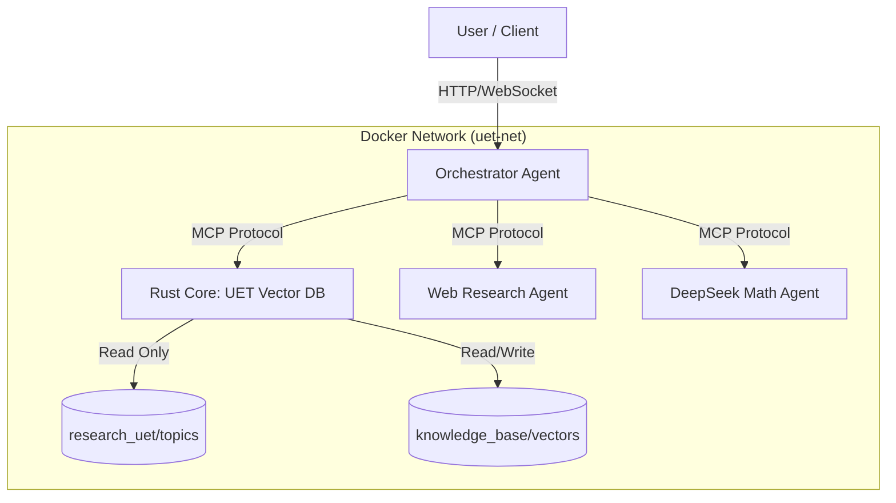

# 🏗️ UET Multi-Agent System: Final Architecture Blueprint

**Date:** 2026-02-12
**Goal:** Build a high-performance, safe, and efficient AI system using Rust & Docker.
**Status:** Blueprint for Implementation (Phase 5+)

---

## 1. The Vision: High-Efficiency AI Ecosystem

The system assumes that **AI Intelligence comes from API (OpenRouter)** but **Data Intelligence comes from Local Physics (UET)**. We minimize token usage by having a "smart" local database that filters context before sending it to the AI.

### Core Principles
1.  **Rust Core:** The "Heavy Lifting" (Vector Math, Search, Data Storage) runs in Rust for max speed/safety.
2.  **Dockerized:** Each component runs in its own container for clean isolation.
3.  **MCP Standard:** Components talk via **Model Context Protocol (MCP)**, allowing easy plug-and-play.

---

## 2. System Architecture



### Components Breakdown

| Component | Tech Stack | Role | Why? |
|:----------|:-----------|:-----|:-----|
| **Orchestrator** | Python / Rust | The "Manager" | Routes queries, manages budget, talks to API. |
| **Rust Core (DB)** | **Rust** | The "Memory" | Calculates UET Vectors ($\Omega$), searches data. **Zero Token Cost.** |
| **Web Agent** | Python (Firecrawl) | The "Eyes" | Browses web, scrapes data (Future extension). |
| **Math Agent** | DeepSeek R1 | The "Calculator" | Solves equations via API. |

---

## 3. Implementation Plan (The "Rust" Way)

We will build the **Rust Core** first, as it's the foundation.

### Step 1: `uet_core` (The Physics Engine)
*   **Language:** Rust 🦀
*   **Goal:** Port `uet_master_equation.py` to Rust.
*   **Key Feature:** Type-safe physics.
    ```rust
    struct UetVector {
        omega: f64,
        kappa: f64,
        entropy: f64,
        // ...
    }
    fn compute_omega(c: &Field, i: &Field) -> f64 { ... }
    ```

### Step 2: `uet_db` (The Database)
*   **Tech:** `LanceDB` (Rust native) or `SQLite` + `Vector Extension`.
*   **Goal:** Store millions of UET Vectors efficiently.
*   **API:** Exposes an MCP Server interface (`stdio` or `SSE`).

### Step 3: `Dockerfile` & `docker-compose.yml`
*   **Goal:** One command startup: `docker-compose up`.
*   **Structure:**
    ```yaml
    services:
      uet-core:
        build: ./uet_core
        volumes:
          - ./research_uet/topics:/data/topics:ro  # Read-Only Research
      orchestrator:
        build: ./agents/orchestrator
        environment:
          - OPENROUTER_API_KEY=${OPENROUTER_API_KEY}
    ```

---

## 4. Work Process: How to Ensure Quality

To prevent "Spaghetti Code" and ensure the system works perfectly:

1.  **TDD (Test Driven Development):**
    *   Write the *Test* first (e.g., "Input: Topic 0.19 -> Output: Omega 0.5").
    *   Write Rust code to pass the test.
    *   **Rule:** No code committed without passing tests.

2.  **Strict Types (No "Shadow Math"):**
    *   Rust prevents us from adding `Apple + Orange`. The compiler checks physics validity.

3.  **CI/CD (Continuous Integration):**
    *   Use GitHub Actions (local script for now) to run `cargo test` automatically before every major change.

---

## 5. Next Immediate Action

**Task:** Initialize the Rust Project Structure.
**Command:** `cargo new uet_core --lib`
