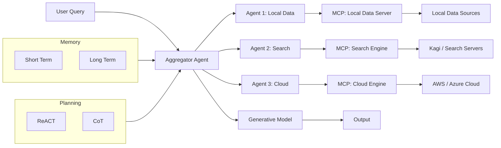
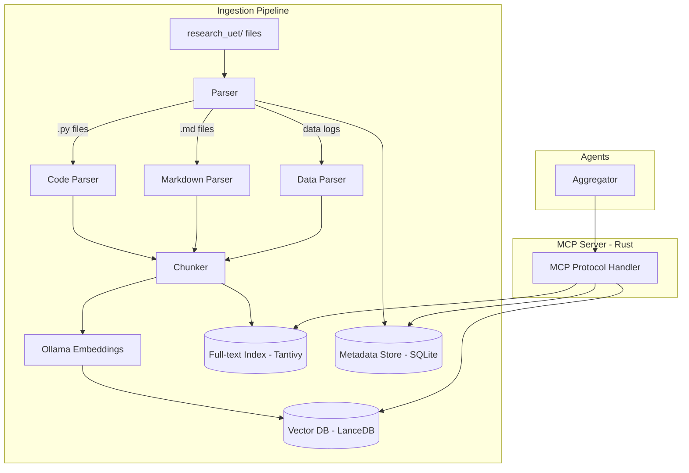

# 🏗️ UET Multi-Agent RAG Architecture — Deep Analysis Report

**Date:** 2026-02-11  
**Scope:** `openclaw-marketing`, `research_uet`, Multi-Agent RAG, Vector DB, Docker, Rust Migration

---

## 1. Current State Summary

### `openclaw-marketing` — Status: ABANDONED ❌

| Asset | Status | Salvageable? |
|:------|:-------|:-------------|
| [PLAN.md](file:///c:/Users/santa/Desktop/lad/Lab_uet_harness_v0.8.7/openclaw-marketing/PLAN.md) (1017 lines) | Very detailed but for OpenClaw framework | ✅ Strategy & content templates |
| [moltbook_poster.py](file:///c:/Users/santa/Desktop/lad/Lab_uet_harness_v0.8.7/openclaw-marketing/scripts/moltbook_poster.py) | Working (manual only) | ✅ Port to new system |
| MCP configs | Template (all `xxx` placeholders) | ✅ Reuse in new architecture |
| Skills (3 SKILL.md files) | Good content strategy docs | ✅ Migrate as prompts/context |
| MEMORY.md / AGENTS.md | Identity & rules defined | ✅ Migrate to new agent |

**Root Cause of Failure:**
1. OpenClaw Docker couldn't execute shell commands reliably
2. Phantom tool calls — LLM tried using non-existent tools
3. Config drift between project files and runtime `~/.openclaw/`

### `research_uet` — Status: ACTIVE ✅

```
research_uet/                    # ~9,368 files
├── core/                        # 13 Python modules (UET engine)
│   ├── uet_master_equation.py   # 29KB — main PDE solver
│   ├── uet_matrix_engine.py     # 10KB — matrix operations
│   ├── uet_parameters.py        # 10KB — κ, β, s parameters
│   └── ...11 more modules
├── topics/                      # 32 research domains
│   ├── 0.0_Grand_Unification/   → 0.31_SpaceTime_Propulsion/
│   ├── General/ (910 files)
│   └── Work/ (10 files)
├── Doc/                         # 130 documentation files (10 subdirs)
├── scripts/                     # 63 utility scripts
└── v/                           # Walkthrough artifacts
```

### Previous Vector Database Attempt: FAILED ❌
- Created 6 files in `knowledge_base/` → all deleted
- Mistakes: rushed code, used old architecture docs, invented ad-hoc tensor format, assumed Qdrant without asking

---

## 2. Multi-Agent RAG Architecture Analysis

### จากรูปที่ให้มา — Mapping to UET System



### สิ่งที่ต้องมี vs สิ่งที่มีแล้ว

| Component (จากรูป) | UET Equivalent | Status | Action Needed |
|:-----|:------|:-------|:------|
| **Aggregator Agent** | ไม่มี | ❌ Missing | สร้างใหม่ — Rust MCP orchestrator |
| **Memory (Short/Long Term)** | [MEMORY.md](file:///c:/Users/santa/Desktop/lad/Lab_uet_harness_v0.8.7/openclaw-marketing/memory/MEMORY.md) (openclaw) | 🟡 Basic | ต้องเปลี่ยนเป็น structured DB |
| **Planning (ReACT/CoT)** | ไม่มี | ❌ Missing | ใช้ LLM built-in + prompt engineering |
| **Agent 1: Local Data** | `research_uet/` data | 🟡 Data exists | สร้าง MCP Server + Vector DB |
| **Agent 2: Search** | ไม่มี | ❌ Missing | ใช้ existing MCP (Firecrawl, Kagi) |
| **Agent 3: Cloud** | ไม่มี | ❌ Missing | Phase 3 — AWS/Azure integration |
| **MCP: Local Data Server** | ไม่มี | ❌ **Critical** | **จำเป็นต้องสร้าง — หัวใจของระบบ** |
| **Generative Model** | Gemini Free / Ollama | ✅ Planned | ใน PLAN.md มีรายละเอียดแล้ว |

---

## 3. Vector Database — จำเป็นต้องทำไหม?

### คำตอบ: **ใช่ จำเป็น — แต่ต้องเลือกแนวทางที่เหมาะสม**

### เหตุผลที่จำเป็น

1. **ข้อมูลมหาศาล** — `research_uet/topics/` มี 9,144 files ข้ามหลายสิบ topics  
2. **Cross-topic Semantic Search** — ต้องค้นความสัมพันธ์ข้าม topic ได้ (เช่น Topic 0.1 ↔ Topic 0.26)
3. **Multi-Agent RAG ต้องการ** — Agent 1 (Local Data) ในรูปจำเป็นต้องมี vector search เพื่อ retrieval
4. **MCP Server ต้องมี backend** — MCP Local Data Server ไม่สามารถ grep ไฟล์ 9K+ ได้ real-time ต้องมี index

### แนวทางที่แนะนำ — Staged Approach

> [!IMPORTANT]
> **ไม่ควรเริ่มจาก Qdrant ทันที** — เรียนรู้จากความผิดครั้งก่อน  
> เริ่มจาก lightweight → scale up ตามความจำเป็น

#### Stage 1: Lightweight Embedded Vector Store (ทำตอนนี้)

| Option | ภาษา | Rust Ready? | ข้อดี | ข้อเสีย |
|:-------|:-----|:------------|:------|:--------|
| **SQLite + sqlite-vss** | C/SQL | ✅ (rusqlite) | ไม่ต้อง install อะไรเพิ่ม, single file DB | Extension อาจ compile ยาก |
| **LanceDB** | Rust native | ✅✅✅ | **Written in Rust**, serverless, embedded | ค่อนข้างใหม่ |
| **Tantivy + embeddings** | Rust native | ✅✅✅ | Full-text + vector hybrid, mature | ต้อง build custom layer |
| **NumPy flat file** | Python | ❌ | ง่ายสุด, ทำได้ทันที | ไม่ scale, ไม่ Rust |

> [!TIP]
> **แนะนำ: LanceDB** — เป็น Rust-native, embedded (ไม่ต้อง Docker), มี Python binding, รองรับ hybrid search

#### Stage 2: Standalone Vector Service (เมื่อ data > 100K vectors)

| Option | ภาษา | Docker? | ข้อดี | ข้อเสีย |
|:-------|:-----|:--------|:------|:--------|
| **Qdrant** | Rust | ✅ | Rust-native, official Rust client, production-ready | ต้อง Docker/process |
| **Milvus** | Go/C++ | ✅ | Massive scale | หนักเกินไปสำหรับตอนนี้ |
| **Weaviate** | Go | ✅ | GraphQL API, hybrid | ไม่ใช่ Rust |

> [!TIP]
> **Stage 2 แนะนำ: Qdrant** — Written in Rust ✅, official `qdrant-client` crate (87.7 benchmark score), Docker-ready, มี documentation ละเอียด

### Embedding Strategy — ใช้ UET Physics

จากบทเรียนครั้งก่อน: **ห้ามใช้ ad-hoc tensor** ต้อง derive จาก UET equations

| Approach | Description | Pros | Cons |
|:---------|:------------|:-----|:-----|
| **Ollama Local Embeddings** | ใช้ `nomic-embed-text` / `mxbai-embed-large` | ฟรี, private, ดี | ต้อง Ollama running |
| **UET-augmented Embeddings** | Standard embedding + UET metadata (κ, β, topic_id) | Physics-informed search | ต้อง design carefully |
| **Hybrid: BM25 + Vector** | keyword search + semantic search | Best accuracy | ซับซ้อนกว่า |

> [!IMPORTANT]
> **Recommended:** ใช้ Ollama local embeddings เป็น base → เพิ่ม UET metadata เป็น structured fields ในภายหลัง  
> **ห้ามทำ:** Invent custom 160-dim tensor อีก

---

## 4. Docker Deployment Strategy

### Current: ❌ ไม่มี Docker เลย

### Proposed Architecture (Docker Compose)

```yaml
# docker-compose.yml (proposed)
services:
  # === Core Services ===
  
  # 1. MCP Local Data Server (Rust)
  uet-mcp-local:
    build: ./uet-mcp-server
    volumes:
      - ./research_uet:/data/research:ro
      - ./vector_db:/data/vectors
    ports:
      - "3100:3100"
    
  # 2. Vector Database (Stage 2 only)
  qdrant:
    image: qdrant/qdrant:latest
    ports:
      - "6333:6333"
      - "6334:6334"
    volumes:
      - qdrant_data:/qdrant/storage

  # 3. Local LLM (Optional)
  ollama:
    image: ollama/ollama
    ports:
      - "11434:11434"
    volumes:
      - ollama_data:/root/.ollama
    deploy:
      resources:
        reservations:
          devices:
            - capabilities: [gpu]

  # === Agent Services ===
  
  # 4. Marketing Agent (replaces openclaw)
  marketing-agent:
    build: ./openclaw-marketing-v2
    depends_on:
      - uet-mcp-local
      - ollama
    env_file: .env
    
volumes:
  qdrant_data:
  ollama_data:
```

### Phased Docker Adoption

| Phase | Services | Timeline |
|:------|:---------|:---------|
| **Phase 1** | Ollama + LanceDB (embedded) | ตอนนี้ — no Docker needed |
| **Phase 2** | Docker: Ollama + Qdrant | เมื่อ data > 100K vectors |
| **Phase 3** | Full stack: all services in Docker | เมื่อพร้อม deploy |

> [!WARNING]
> **Disk Space:** ตอนนี้เหลือ ~2.5 MB บน C: — ต้องย้ายไป drive อื่นก่อน Docker ได้  
> Docker images ต้องการ: Qdrant ~300MB, Ollama ~500MB+, model files 4-8GB

---

## 5. Rust Migration Strategy

### สิ่งที่มีอยู่แล้วใน Rust

```
research_uet/topics/0.18_Mathnicry/rust_miner/
├── Cargo.toml      # tokio, wgpu, rayon, serde, sha2
├── src/            # 13 source files
├── uet_miner.exe   # 5MB compiled binary
└── uet_miner_linux # 4.4MB compiled binary
```

**Dependencies ที่ทีมคุ้นเคยแล้ว:** tokio (async), serde (serialization), rayon (parallel), wgpu (GPU)

### Rust Component Roadmap

| Priority | Component | Rust Crate(s) | Purpose |
|:---------|:----------|:-------------|:--------|
| 🔴 **1st** | MCP Local Data Server | `rmcp`, `tokio`, `serde` | MCP Server ค้นหาข้อมูลจากเครื่อง |
| 🟠 **2nd** | Vector Store Client | `lancedb` / `qdrant-client` | จัดการ embeddings |
| 🟡 **3rd** | UET Lite Engine (Rust port) | `ndarray`, `nalgebra` | Port core equations to Rust |
| 🟢 **4th** | Aggregator Agent | `rmcp`, custom | Multi-agent orchestration |
| 🔵 **5th** | Full UET Core | `ndarray`, `wgpu` | Replace all Python core |

### Key Rust Crates ที่แนะนำ

```toml
# สำหรับ MCP Server
[dependencies]
rmcp = "0.1"          # Rust MCP SDK (official)
tokio = { version = "1", features = ["full"] }
serde = { version = "1", features = ["derive"] }
serde_json = "1"

# สำหรับ Vector DB
lancedb = "0.5"       # Embedded vector DB (Rust-native)
# OR
qdrant-client = "1.8" # Qdrant gRPC client

# สำหรับ Embeddings (local)
fastembed = "3"       # Local embedding models in Rust

# สำหรับ Text Processing
tantivy = "0.22"      # Full-text search (Lucene-like, pure Rust)
```

### Reference Project: `rust-local-rag`

จากบทความที่ศึกษา ([Local RAG with Rust and MCP](https://medium.com/@ksaritek/local-rag-with-rust-and-mcp-private-document-search-for-claude-desktop-6fccb37c024e)):

```
┌─────────────────┐  MCP Protocol  ┌──────────────┐
│ Claude Desktop  │◄──stdin/stdout──►│ Rust RAG     │
│ (or any LLM)   │                 │ MCP Server   │
└─────────────────┘                └──────┬───────┘
                                          │
                                   ┌──────▼───────┐
                                   │ • PDF Parser  │
                                   │ • Ollama      │
                                   │ • Vector Store│
                                   └──────────────┘
```

**โปรเจกต์นี้ตรงกับสิ่งที่คุณต้องการเป๊ะ** — Rust + MCP + local data + vector search  
GitHub: [ksaritek/rust-local-rag](https://github.com/ksaritek/rust-local-rag)

---

## 6. `openclaw-marketing` → แยกเป็นโปรเจกต์ใหม่?

### คำตอบ: **ใช่ ควรแยก — แต่ต้อง redesign ใหม่ทั้งหมด**

### เหตุผลที่ควรแยก

1. **Concern Separation** — Marketing agent ≠ Physics research engine
2. **Deployment Independence** — สามารถ deploy agent โดยไม่กระทบ research code
3. **Team Scalability** — คนทำ marketing ไม่จำเป็นต้องรู้ UET physics
4. **Abandoned Code** — OpenClaw framework ใช้ไม่ได้จริง ต้อง rebuild

### สิ่งที่ต้องย้ายออก

| From `openclaw-marketing/` | To New Project | Transform |
|:---------------------------|:---------------|:----------|
| `PLAN.md` (strategy) | `docs/strategy.md` | Strip OpenClaw-specific, keep content strategy |
| `skills/*.md` (3 files) | `prompts/` or `context/` | Convert to system prompts |
| `memory/MEMORY.md` | `config/agent_identity.toml` | Structured config, not freeform MD |
| `memory/AGENTS.md` | `config/agent_rules.toml` | Same |
| `scripts/moltbook_poster.py` | `src/integrations/moltbook.rs` | Rewrite in Rust |
| `config/mcp_config.json` | `config/mcp.json` | Keep, update paths |
| `config/openclaw.json` | **DELETE** | OpenClaw-specific, useless |

### New Project Structure (Proposed)

```
uet-agent/                       # NEW standalone project
├── Cargo.toml                   # Rust project root
├── config/
│   ├── agent.toml               # Agent identity & rules
│   ├── mcp.json                 # MCP server connections
│   └── .env.example             # API keys template
├── src/
│   ├── main.rs                  # Entry point
│   ├── mcp_server.rs            # Local Data MCP Server
│   ├── aggregator.rs            # Multi-agent orchestrator
│   ├── memory.rs                # Short/Long term memory
│   ├── vector_store.rs          # LanceDB/Qdrant interface
│   └── integrations/
│       ├── discord.rs           # Discord bot
│       ├── moltbook.rs          # Moltbook posting
│       └── social.rs            # Twitter/Reddit/Bluesky
├── prompts/
│   ├── knowledge_base.md        # UET knowledge for content
│   ├── content_calendar.md      # Posting schedule
│   └── brand_voice.md           # Brand guidelines
├── docker/
│   ├── Dockerfile               # Agent container
│   └── docker-compose.yml       # Full stack
└── README.md
```

---

## 7. MCP Server สำหรับ Local Data — Design

### จำเป็นต้องทำ Local Data เป็น Vector Database ไหม?

> [!IMPORTANT]
> **ใช่ แต่เป็น Hybrid approach:**
> - **Vector DB** สำหรับ semantic search (ค้นหาด้วยความหมาย)
> - **Full-text index** สำหรับ keyword search (ค้นหาด้วยคำ)
> - **Structured metadata** สำหรับ filtering (topic_id, file_type, etc.)

### MCP Server Tools ที่ต้องมี

| MCP Tool | Function | Data Source |
|:---------|:---------|:------------|
| `search_research` | Semantic search across all topics | Vector DB |
| `get_topic_detail` | Get specific topic data | File system |
| `list_topics` | List all 32 research topics | Metadata |
| `search_equations` | Find specific equations/formulas | Full-text index |
| `get_cross_references` | Find topic relationships | Graph/metadata |
| `get_data_log` | Get simulation run results | File system |

### Data Flow



---

## 8. Recommended Implementation Order

| Phase | What | Tech | Timeline | Dependencies |
|:------|:-----|:-----|:---------|:-------------|
| **0. Prep** | Free disk space, install Rust toolchain | — | Day 1 | C: drive has 2.5MB free! |
| **1. MCP Server** | Rust MCP server reading `research_uet/` | Rust + rmcp | Week 1-2 | Rust installed |
| **2. Embeddings** | Local embeddings + LanceDB | Ollama + LanceDB | Week 2-3 | Ollama installed |
| **3. Ingestion** | Index all 9K+ files | Custom pipeline | Week 3-4 | Phase 1+2 |
| **4. Agent** | Simple aggregator with memory | Rust + rmcp | Week 4-5 | Phase 1-3 |
| **5. Docker** | Containerize everything | Docker Compose | Week 5-6 | All above |
| **6. Marketing** | Rebuild marketing agent | Rust + Discord | Week 6-8 | Phase 4+5 |

---

## 9. Key Decisions Needed from You

1. **Disk Space:** C: drive มี 2.5 MB — ต้องย้ายโปรเจกต์ไป drive อื่นก่อนหรือเปล่า?
2. **Vector DB Choice:** เริ่มจาก LanceDB (embedded, Rust-native) หรือ ต้องการ Qdrant (Docker)?
3. **Embedding Model:** ใช้ Ollama local หรือ Gemini API (free tier)?
4. **Project Location:** New repo ชื่ออะไร (`uet-agent`?) อยู่ที่ไหน?
5. **Priority:** เริ่มจาก MCP Local Data Server ก่อน หรือ Marketing Agent ก่อน?

---

## 10. สรุป

| Question จาก User | Answer |
|:-------------------|:-------|
| ต้องทำ Vector DB ไหม? | ✅ **ใช่** — 9K+ files ต้องมี index สำหรับ semantic search |
| ต้องเป็น Vector DB ไหม? | ✅ **Hybrid** — Vector + Full-text + Metadata |
| ใช้ Rust เลยไหม? | ✅ **ใช่** — ทีมมี Rust experience แล้ว (rust_miner), มี rmcp crate สำหรับ MCP |
| แยก openclaw-marketing ไหม? | ✅ **ใช่** — Redesign ใหม่ในชื่อ `uet-agent`, ทิ้ง OpenClaw framework |
| Docker เมื่อไหร่? | 🟡 **Phase 5** — เริ่มจาก local development ก่อน, Docker เมื่อ stable |
| MCP Server ทำอะไร? | 🔴 **Core** — Rust MCP server ค้นหา local data ด้วย vector + full-text search |
