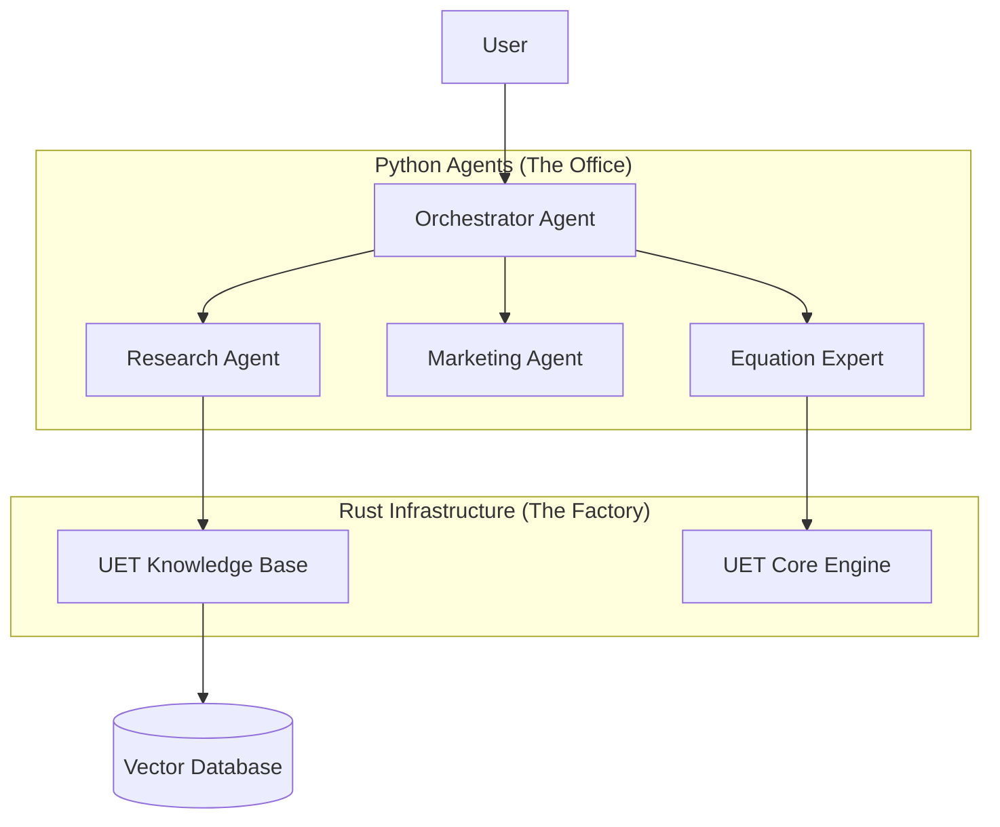

# 🧠 UET Agents: The Executive Branch

> **"The Office" of the UET System.**
> While `uet_core` is the factory (Rust Engine) and `uet_kb` is the warehouse (Rust Database), this directory (`uet_agents`) is where the **Decisions** and **Logic** happen.

## 🌟 Why Python?
We use Python for Agents because:
1.  **LLM Native:** AI models speak Python (PyTorch, SDKs).
2.  **Flexibility:** Logic for conversation and reasoning changes often; Python is agile.
3.  **Orchestration:** Python is excellent at gluing together high-performance Rust components.

## 🤖 The Workforce

| Agent | Role | File |
| :--- | :--- | :--- |
| **Orchestrator** | **The Boss.** Routes queries to the right specialist. | `orchestrator.py` |
| **ResearchAgent** | **The Librarian.** Searches `uet_kb` for verified knowledge. | `research_agent.py` |
| **MarketingAgent** | **The PR Officer.** Manages Social Media & Moltbook protocol. | `marketing_agent.py` |
| **EquationExpert** | **The Mathematician.** Verifies math & dimensions. | `base_agent.py` (specialized) |

## 🚀 How to Run

Run the main orchestrator loop from the project root:

```bash
# Windows
python uet_agents/main.py

# Linux/Mac
python3 uet_agents/main.py
```

## 🔗 Relationship to System


