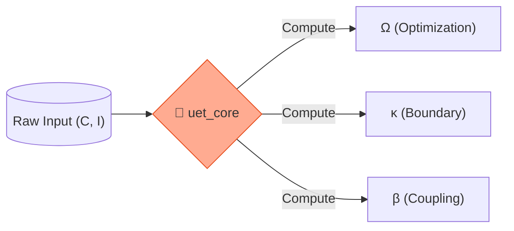

# ⚛️ UET Core Engine (`uet_core`)


> **"The Physics Engine of UET"** - คำนวณสมการแม่บท (Master Equation) ด้วยความเร็วและตรรกะที่ถูกต้องแม่นยำที่สุด (High-Performance Computing).

---

## 🏛️ Architecture Pillars

| Component | Description |
| :--- | :--- |
| **Dynamics** | คำนวณค่า $\Omega$ (Omega), $\kappa$ (Kappa), $\beta$ (Beta) ตามทฤษฎี. |
| **Fields** | จัดการโครงสร้าง Tensor Field (C, I) สำหรับการคำนวณ. |
| **Safety** | ใช้ระบบ Type System ของ Rust ป้องกัน Logical Error 100%. |

---

## 🔗 Theory Connection



---

## 🚀 Key Functions

- **`compute_omega(c, i)`**: หัวใจหลักของการหาค่าความสมดุล (Balance).
- **`Field::new(data)`**: สร้างสนามพลังงานสำหรับการทดสอบ.

---

## 🛠️ Usage

ใช้เป็น Library สำหรับ `uet_kb` หรือ Python Binding:

```rust
use uet_core::dynamics;
let omega = dynamics::compute_omega(&config, &field_c, &field_i);
```
