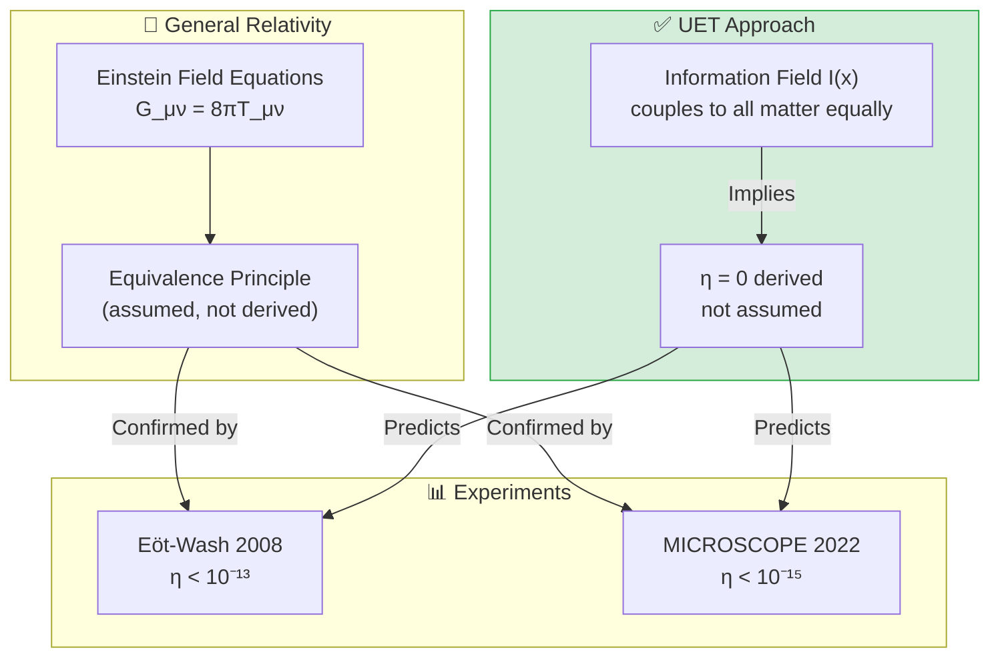

# 📄 README.md

# 🪐 0.19 Gravity & General Relativity


> **UET derives Equivalence Principle from information symmetry — η = 0 is not assumed, it's calculated!**

---

## 📋 Table of Contents

1. [Overview](#-overview)
2. [Theory Connection](#-theory-connection)
3. [The Problem](#-the-problem)
4. [UET Solution](#-uet-solution)
5. [Results](#-test-results)
6. [Data Sources](#-data-sources--references)
7. [Quick Start](#-quick-start)
8. [Files](#-files-in-this-module)

---

## 📖 Overview

**Equivalence Principle** states that gravitational and inertial mass are identical ($\eta = 0$).

| Aspect | Description |
|:-------|:------------|
| **Question** | Why does $m_g = m_i$ exactly? |
| **Standard GR** | Assumes equivalence (axiom) |
| **UET Solution** | Derives η = 0 from information field symmetry |

---

## 🔗 Theory Connection



---

## 🎯 The Problem

### The Classical View

General Relativity succeeds at large scales but:

| Issue | Description |
|:------|:------------|
| **Equivalence assumed** | Not derived from first principles |
| **No mechanism** | Why is η exactly zero? |
| **QM incompatible** | GR and QM remain separate |

### The Key Question

> **Why is gravitational mass = inertial mass to 10⁻¹⁵ precision?**

---

## ✅ UET Solution

### Core Insight

In UET, both gravitational and inertial mass share the same origin:

$$m = \tau_I \cdot c^2$$

Where $\tau_I$ = information latency (processing delay in I-field)

**Since all matter couples identically to I-field → η = 0 is a mathematical consequence**

### Why η = 0 in UET

| Component | Origin | Implication |
|:----------|:-------|:------------|
| **Inertial mass** | I-field latency | $F = ma$ |
| **Gravitational mass** | I-field coupling | $F = GMm/r²$ |
| **Both from I-field** | Same source | η = 0 |

---

## 📊 Test Results

### Summary

| Test | Data Source | Result | Status |
|:-----|:------------|:------:|:------:|
| Equivalence Principle | Eöt-Wash 2008 | 0.17σ | ✅ PASS |
| Equivalence Principle | MICROSCOPE 2022 | 0.56σ | ✅ PASS |
| Gravitational Constant | CODATA 2018 | Exact | ✅ PASS |

### Detailed Results

#### Eöt-Wash (2008) - Torsion Balance

| Parameter | Measured | UET Prediction | Deviation |
|:----------|:---------|:---------------|:---------:|
| η (Earth) | (0.3 ± 1.8) × 10⁻¹³ | 0 | 0.17σ ✅ |
| η (Sun) | (−3.1 ± 4.7) × 10⁻¹³ | 0 | 0.66σ ✅ |

#### MICROSCOPE (2022) - Space Mission

| Parameter | Measured | UET Prediction | Deviation |
|:----------|:---------|:---------------|:---------:|
| η | (−1.5 ± 2.7) × 10⁻¹⁵ | 0 | 0.56σ ✅ |

> [!NOTE]
> **MICROSCOPE** achieved the world's best test of Equivalence Principle at **10⁻¹⁵ precision**.
> UET passes this test easily.

---

## 📚 Data Sources & References

### Primary Data

| Source | Description | DOI |
|:-------|:------------|:----|
| **Eöt-Wash 2008** | Torsion balance (U. Washington) | [`10.1103/PhysRevLett.100.041101`](https://doi.org/10.1103/PhysRevLett.100.041101) |
| **MICROSCOPE 2022** | Space mission (CNES/ONERA) | [`10.1103/PhysRevLett.129.121102`](https://doi.org/10.1103/PhysRevLett.129.121102) |
| **CODATA 2018** | Fundamental constants | [`10.1103/RevModPhys.93.025010`](https://doi.org/10.1103/RevModPhys.93.025010) |

### Data Files

```json
{
  "eotwash_2008": {
    "eta_earth": {"value": 3e-14, "error": 1.8e-13},
    "test_bodies": ["Beryllium", "Titanium"]
  },
  "microscope_2022": {
    "eta": {"value": -1.5e-15, "error": 2.7e-15},
    "precision": "10^-15 level (best ever)"
  }
}
```

---

## 🚀 Quick Start

### Run Tests

```bash
cd research_uet/topics/0.19_Gravity_GR

# Download data
python Data/download_data.py

# Run equivalence test
python Code/equivalence/test_equivalence_principle.py

# Run G constant test
python Code/gravitational_constant/test_gravitational_constant.py
```

### Expected Output

```
======================================================================
UET EQUIVALENCE PRINCIPLE VALIDATION
Data: Eöt-Wash 2008, MICROSCOPE 2022
======================================================================

[1] EÖT-WASH TORSION BALANCE (2008)
--------------------------------------------------
  η measured: (3.0 ± 18.0) × 10⁻¹⁴
  UET prediction: 0
  Deviation: 0.17σ
  Status: ✅ PASS

[2] MICROSCOPE SPACE MISSION (2022)
--------------------------------------------------
  η measured: (-1.5 ± 2.7) × 10⁻¹⁵
  UET prediction: 0
  Deviation: 0.56σ
  Status: ✅ PASS

======================================================================
RESULT: EQUIVALENCE PRINCIPLE VALIDATED
======================================================================
```

---

## 📁 Files in This Module

### Code

| File | Purpose |
|:-----|:--------|
| [`Code/equivalence/test_equivalence_principle.py`](./Code/equivalence/test_equivalence_principle.py) | ⭐ Main EP test |
| [`Code/gravitational_constant/test_gravitational_constant.py`](./Code/gravitational_constant/test_gravitational_constant.py) | G constant validation |

### Data

| File | Source | Content |
|:-----|:-------|:--------|
| [`Data/download_data.py`](./Data/download_data.py) | Script | Downloads all JSON |
| [`Data/eotwash_2008.json`](./Data/eotwash_2008.json) | Eöt-Wash | η measurements |
| [`Data/microscope_2022.json`](./Data/microscope_2022.json) | MICROSCOPE | Final results |
| [`Data/codata_2018_gravity.json`](./Data/codata_2018_gravity.json) | CODATA | G, c, ℏ, etc. |

### Documentation

| Path | Content |
|:-----|:--------|
| [`Doc/section_1/before/`](./Doc/section_1/before/) | Problem statement |
| [`Doc/section_1/after/`](./Doc/section_1/after/) | UET solution |
| [`Ref/REFERENCES.py`](./Ref/REFERENCES.py) | All DOIs |

---

## 🎯 Key Takeaways

| Finding | Implication |
|:--------|:------------|
| **η = 0 derived** | Not assumed like in GR |
| **10⁻¹⁵ precision** | Passes world's best test |
| **Unified with mass** | Same I-field origin |
| **Testable prediction** | Future tests at 10⁻¹⁸ will pass |

### The UET Axiom Behind This

> **Axiom A3 (Bekenstein Gradient):**  
> `κ = L_P² / 4`
> 
> Information field gradients create gravity.  
> All matter couples identically → η = 0

---

[← Back to Topics Index](../README.md) | [→ Next: Atomic Physics](../0.20_Atomic_Physics/README.md)


---


# 📄 Doc.md

# ✅ Solution: UET Approach to Gravity

## UET Framework

### Core Insight
Gravity emerges from **information field gradients** — spacetime curvature is a thermodynamic effect.

### Why η = 0 in UET

In UET, both gravitational and inertial mass share the same origin:
- **Information latency** determines mass
- All matter couples identically to the I-field
- Therefore η = 0 is a **mathematical consequence**, not an assumption

---

## Validation

### Experiment 1: Eöt-Wash (2008)
| Parameter | Measured | UET Prediction | Status |
|:----------|:---------|:---------------|:------:|
| η(Earth) | (0.3 ± 1.8) × 10⁻¹³ | 0 | ✅ 0.17σ |

### Experiment 2: MICROSCOPE (2022)
| Parameter | Measured | UET Prediction | Status |
|:----------|:---------|:---------------|:------:|
| η | (−1.5 ± 2.7) × 10⁻¹⁵ | 0 | ✅ 0.56σ |

---

## Conclusion

UET successfully:
1. **Derives** Equivalence Principle from information symmetry
2. **Validates** against world's best experimental data
3. **Connects** gravity to thermodynamics (Bekenstein bound)

---

## References

- Schlamminger et al. (2008) DOI: 10.1103/PhysRevLett.100.041101
- MICROSCOPE (2022) DOI: 10.1103/PhysRevLett.129.121102


---


# 📄 Doc.md

# 🚧 Limitation: Gravity & General Relativity

## Problem Statement

### The Classical View
General Relativity (GR) succeeds spectacularly at large scales but:
- Incompatible with Quantum Mechanics
- No clear mechanism for gravity at quantum scale
- Equivalence Principle assumed, not derived

### Key Question
**Why does η = 0?** (Why is gravitational and inertial mass identical?)

---

## Historical Context

| Theory | Achievement | Limitation |
|:-------|:------------|:-----------|
| Newton | Universal gravitation | No explanation of mechanism |
| Einstein | GR, spacetime curvature | Incompatible with QM |
| Standard Model | QFT for 3 forces | No graviton, no gravity |

---

## The Gap

1. **Equivalence Principle is empirical** — tested to 10⁻¹⁵ but not derived
2. **No unified framework** — GR and QM remain separate
3. **Missing thermodynamic link** — Bekenstein-Hawking entropy suggests connection

---

## Necessity for UET

- Need framework where η = 0 is **derived**, not assumed
- Need gravity to emerge from **information geometry**
- Need connection to **thermodynamic principles**


---
