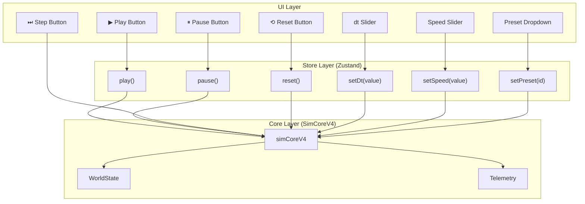
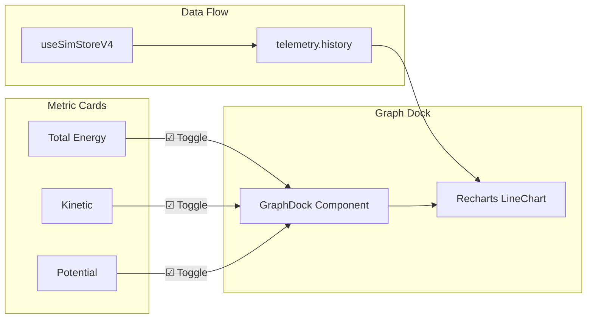

# 🎬 Animation & Interactive Components Specification

> **Version:** 1.0
> **Last Updated:** 2025-12-23
> **Status:** Active Design Document

---

## 📋 Table of Contents

1. [Animation System](#animation-system)
2. [Panel Animations](#panel-animations)
3. [Button-Function Connections](#button-function-connections)
4. [Interactive Data Components](#interactive-data-components)
5. [Modal & Window Designs](#modal--window-designs)
6. [Graph Integration](#graph-integration)

---

## 🎬 Animation System

### Global Animation Tokens

```css
/* Duration */
--duration-fast: 150ms;    /* Micro-interactions */
--duration-normal: 300ms;  /* Panel slides, modals */
--duration-slow: 500ms;    /* Page transitions */

/* Easing */
--ease-out: cubic-bezier(0.16, 1, 0.3, 1);   /* Most UI animations */
--ease-spring: cubic-bezier(0.34, 1.56, 0.64, 1); /* Bouncy feedback */
--ease-smooth: ease-in-out;                   /* Linear movements */
```

### Animation Types

| Type | Duration | Easing | Use Case |
|------|----------|--------|----------|
| **Fade** | 150ms | ease-out | Tooltips, overlays |
| **Slide** | 300ms | ease-out | Panels, drawers |
| **Scale** | 200ms | spring | Buttons, cards hover |
| **Reveal** | 300ms | ease-out | Content appear |

---

## 📐 Panel Animations

### Left Panel (Output)

```
┌────────────────────────────────────────────────────┐
│                                                    │
│  ◀──────── Slide Animation (300ms) ─────────▶     │
│                                                    │
│  Closed (0px)              Open (320px)           │
│  opacity: 0                opacity: 1             │
│                                                    │
└────────────────────────────────────────────────────┘
```

**Animation Sequence:**
1. Width: `0px → 320px` (300ms, ease-out)
2. Opacity: `0 → 1` (200ms, starts at 100ms)
3. Content fade-in: staggered (50ms per item)

### Right Panel (Studio)

Same as Left Panel but:
- Direction: Right to Left
- Width: `0px → 280px`

### Graph Dock (Bottom)

```
┌────────────────────────────────────────────────────┐
│  Collapsed (32px) ─────▶ Expanded (180px)         │
│                                                    │
│  ─────────┬─────────                              │
│           │   ▲                                   │
│           │   │ Slide Up                          │
│           │   │                                   │
│  ═════════╧═══╧═════════                          │
│  [Chart content appears]                          │
└────────────────────────────────────────────────────┘
```

---

## 🔘 Button-Function Connections

### Connection Map



### Button Connections Table

| Button | Function | Parameters | State Changes | Side Effects |
|--------|----------|------------|---------------|--------------|
| **Play ▶** | `useSimStoreV4.play()` | None | `status: 'running'` | Starts animation loop |
| **Pause ⏸** | `useSimStoreV4.pause()` | None | `status: 'paused'` | Stops animation loop |
| **Step ⏭** | `simCoreV4.step()` | None | `t += dt`, `step++` | Single frame advance |
| **Reset ⟲** | `useSimStoreV4.reset()` | None | `t=0`, `step=0`, bodies=initial | Clears telemetry |
| **dt Slider** | `useSimStoreV4.setDt(v)` | `number` | `dt = v` | Affects simulation speed |
| **Speed Slider** | `useSimStoreV4.setSpeed(v)` | `number` | `speed = v` | Affects render rate |
| **Preset Select** | `useSimStoreV4.setPreset(id)` | `PresetName` | All params reset | Reinitializes bodies |

---

## 🔢 Interactive Data Components

### Clickable Metric Card

Values can be clicked to:
1. **Toggle Graph Display** - Show/hide in dock
2. **Open Detail Modal** - Full stats view
3. **Copy Value** - To clipboard

```
┌─────────────────────────────────────┐
│  📊 Total Energy                    │
│                                     │
│     -1.234e+7                      │ ← Click to toggle graph
│     ──────────                      │
│     [▼] J (Joules)                 │ ← Click to change units
│                                     │
│  ┌───────────────────────────────┐ │
│  │ ▁▂▃▄▅▆▇█▇▆▅▄▃▂▁              │ │ ← Mini sparkline
│  └───────────────────────────────┘ │
│                                     │
│  [📋] [📊] [🔗]                    │ ← Action buttons
└─────────────────────────────────────┘

Actions:
  [📋] Copy value to clipboard
  [📊] Toggle in main graph
  [🔗] Link to equations panel
```

### Interactive Parameter Input

```
┌─────────────────────────────────────┐
│  Time Step (dt)                     │
│  ┌─────────────────────────────┐   │
│  │ 0.01                    ○───│   │ ← Input + slider hybrid
│  └─────────────────────────────┘   │
│  ├──○────────────────────────────┤ │ ← Slider below
│  0.001                       0.1   │
│                                     │
│  ⚠️ Warning: dt > 0.05 may cause   │ ← Context-aware warning
│     instability                     │
└─────────────────────────────────────┘
```

### Graph + Number Combo Display

```
┌────────────────────────────────────────────────────┐
│  Kinetic Energy                    Current: 1.23e6 │
│  ┌───────────────────────────────────────────────┐ │
│  │         ╱╲    ╱╲                              │ │
│  │        ╱  ╲  ╱  ╲           ╱                │ │
│  │   ╱╲  ╱    ╲╱    ╲    ╱╲  ╱                 │ │
│  │  ╱  ╲╱            ╲  ╱  ╲╱                   │ │
│  │ ╱                  ╲╱                        │ │
│  └───────────────────────────────────────────────┘ │
│  t: 0.0s                                    10.0s  │
│                                                    │
│  [Min: 0.5e6] [Max: 2.1e6] [Avg: 1.4e6] [σ: 0.3e6]│
│  ────────────────────────────────────────────────  │
│  ☑ Show on dock   ☑ Log scale   ☐ Overlay others   │
└────────────────────────────────────────────────────┘
```

---

## 🪟 Modal & Window Designs

### Modal Template

```
┌──────────────────────────────────────────────────┐
│ ┌──────────────────────────────────────────────┐ │
│ │  Modal Title                              ✕  │ │ ← Header (drag zone)
│ ├──────────────────────────────────────────────┤ │
│ │                                              │ │
│ │  Content Area                                │ │
│ │  - Forms                                     │ │
│ │  - Information                               │ │
│ │  - Graphs                                    │ │
│ │                                              │ │
│ ├──────────────────────────────────────────────┤ │
│ │                    [Cancel] [Primary Action] │ │ ← Footer
│ └──────────────────────────────────────────────┘ │
└──────────────────────────────────────────────────┘
  ↑ Backdrop (click to close, or ESC)

Animation:
  - Backdrop: opacity 0→0.7 (200ms)
  - Modal: scale 0.95→1.0 + opacity 0→1 (300ms, spring)
```

### Add Project Modal

```
┌──────────────────────────────────────────────────┐
│  Add New Project                             ✕   │
├──────────────────────────────────────────────────┤
│                                                  │
│  Project Name *                                  │
│  ┌──────────────────────────────────────────┐   │
│  │ My Simulation                             │   │
│  └──────────────────────────────────────────┘   │
│                                                  │
│  Description                                     │
│  ┌──────────────────────────────────────────┐   │
│  │ Testing galaxy formation...              │   │
│  │                                          │   │
│  └──────────────────────────────────────────┘   │
│                                                  │
│  Category          Preset                        │
│  ┌───────────┐    ┌────────────────┐            │
│  │ Physics ▼ │    │ Solar System ▼ │            │
│  └───────────┘    └────────────────┘            │
│                                                  │
│  ─────────────────────────────────────────────  │
│  ⚙️ Parameters                                   │
│  ┌────────┐ ┌────────┐ ┌────────┐ ┌────────┐   │
│  │ T: 5   │ │ dt:0.01│ │ N: 32  │ │ β: 0.5 │   │
│  └────────┘ └────────┘ └────────┘ └────────┘   │
│                                                  │
├──────────────────────────────────────────────────┤
│                         [Cancel]  [Save Project] │
└──────────────────────────────────────────────────┘
```

### Settings Modal

```
┌──────────────────────────────────────────────────┐
│  ⚙️ Settings                                 ✕   │
├──────────────────────────────────────────────────┤
│                                                  │
│  ┌────────────────────────────────────────────┐ │
│  │ Display  │ Performance │ Export │ About    │ │ ← Tabs
│  └────────────────────────────────────────────┘ │
│                                                  │
│  Display Settings                                │
│  ───────────────                                │
│                                                  │
│  Unit Mode                                       │
│  ○ Physical (SI)    ● Natural (c=G=ℏ=1)         │
│                                                  │
│  Theme                                           │
│  ● Dark             ○ Light (Coming soon)       │
│                                                  │
│  Graph Style                                     │
│  ☑ Smooth lines     ☐ Show grid                 │
│  ☑ Auto-scale       ☑ Show legend               │
│                                                  │
│  Panel Defaults                                  │
│  ☑ Left panel open  ☑ Right panel open          │
│  ☑ Dock expanded                                │
│                                                  │
├──────────────────────────────────────────────────┤
│                              [Reset] [Apply]     │
└──────────────────────────────────────────────────┘
```

---

## 📊 Graph Integration

### Graph-Button Connection



### Metric → Graph Flow

1. **User clicks metric card checkbox**
2. **State updates:** `visibleMetrics.add(metricId)`
3. **Graph re-renders** with new data series
4. **Animation:** Line draws in (300ms)

### Graph Controls

```
┌────────────────────────────────────────────────────┐
│ ◉ Energy   ◉ Momentum   ○ Position   ○ Velocity   │ ← Toggle visibility
│ ┌────────────────────────────────────────────────┐ │
│ │                                                │ │
│ │        Graph Area (auto-updates at 60 FPS)    │ │
│ │                                                │ │
│ └────────────────────────────────────────────────┘ │
│ [🔍 Zoom] [↔ Pan] [📷 Export PNG] [📄 Export CSV]  │
└────────────────────────────────────────────────────┘
```

---

## 🎯 Implementation Checklist

### Animation Implementations

| Component | Animation | Status |
|-----------|-----------|--------|
| Panel slide | ✅ | CSS transition |
| Modal appear | ⬜ | Need to add |
| Button hover | ✅ | Tailwind |
| Graph draw | ⬜ | Recharts animation |
| Toast appear | ⬜ | Not implemented |

### Interactive Components

| Component | Click Action | Status |
|-----------|--------------|--------|
| Metric card | Toggle graph | ⬜ |
| Param input | Update value | ✅ |
| Preset dropdown | Reset sim | ✅ |
| Graph line | Show tooltip | ⬜ |

---

## 📝 Notes

### Performance Considerations

- Use `will-change: transform` for panel animations
- Debounce slider inputs (100ms)
- Throttle graph updates (16ms = 60fps)
- Use `requestAnimationFrame` for smooth animations

### Accessibility

- All animations respect `prefers-reduced-motion`
- Buttons have focus states (`ring-2 ring-cyan-500`)
- Modals trap focus
- Keyboard shortcuts documented
