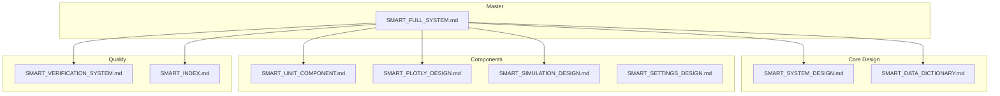
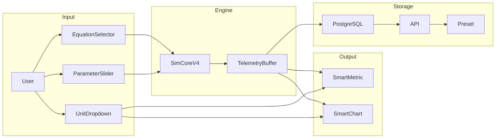

# 🧠 SMART SYSTEM - Complete Reference

> **The Ultimate Guide to UET Smart System**  
> รวมทุกอย่างของ Smart System ไว้ในที่เดียว  
> **Last Updated:** 2024-12-24

---

## 📚 Document Map



---

## 📁 All Smart Documents (8 Files)

| # | Document | Purpose | Lines |
|---|----------|---------|-------|
| 1 | [SMART_SYSTEM_DESIGN](design_system/SMART_SYSTEM_DESIGN.md) | Parameters + DB Integration | ~250 |
| 2 | [SMART_DATA_DICTIONARY](SMART_DATA_DICTIONARY.md) | All Metrics + Units | ~200 |
| 3 | [SMART_UNIT_COMPONENT](design_system/SMART_UNIT_COMPONENT.md) | Unit Converter Button | ~200 |
| 4 | [SMART_PLOTLY_DESIGN](design_system/SMART_PLOTLY_DESIGN.md) | Charts + Visualization | ~300 |
| 5 | [SMART_SIMULATION_DESIGN](design_system/SMART_SIMULATION_DESIGN.md) | Engine + Control | ~350 |
| 6 | [SMART_SETTINGS_DESIGN](design_system/SMART_SETTINGS_DESIGN.md) | **Settings = Verification View** | ~200 |
| 7 | [SMART_VERIFICATION_SYSTEM](SMART_VERIFICATION_SYSTEM.md) | L0-L5 Tests | ~400 |
| 8 | [SMART_INDEX](design_system/SMART_INDEX.md) | File Structure + Audit | ~100 |

---

## 🏗️ System Architecture

```
┌─────────────────────────────────────────────────────────────────────────────┐
│                           SMART SYSTEM ARCHITECTURE                          │
├─────────────────────────────────────────────────────────────────────────────┤
│                                                                              │
│  ┌─────────────────────────────────────────────────────────────────────┐    │
│  │                    📊 DATA LAYER                                      │    │
│  │  ┌──────────────┐  ┌──────────────┐  ┌──────────────┐               │    │
│  │  │ metrics.json │  │ equations/   │  │ PostgreSQL   │               │    │
│  │  │ (Definitions)│  │ registry.ts  │  │ (Persistence)│               │    │
│  │  └──────┬───────┘  └──────┬───────┘  └──────┬───────┘               │    │
│  └─────────┼─────────────────┼─────────────────┼───────────────────────┘    │
│            │                 │                 │                             │
│            ▼                 ▼                 ▼                             │
│  ┌─────────────────────────────────────────────────────────────────────┐    │
│  │                    🔌 SERVICE LAYER                                   │    │
│  │  ┌──────────────┐  ┌──────────────┐  ┌──────────────┐               │    │
│  │  │MetricRegistry│  │EquationReg. │  │ UnitConverter│               │    │
│  │  │ Service      │  │ Service     │  │ Service      │               │    │
│  │  └──────┬───────┘  └──────┬───────┘  └──────┬───────┘               │    │
│  └─────────┼─────────────────┼─────────────────┼───────────────────────┘    │
│            │                 │                 │                             │
│            ▼                 ▼                 ▼                             │
│  ┌─────────────────────────────────────────────────────────────────────┐    │
│  │                    ⚛️ COMPONENT LAYER                                 │    │
│  │  ┌──────────────┐  ┌──────────────┐  ┌──────────────┐               │    │
│  │  │ SmartMetric  │  │ParameterCard│  │ SmartChart   │               │    │
│  │  │ (Unit Conv.) │  │ (Inputs)    │  │ (Plotly)     │               │    │
│  │  └──────────────┘  └──────────────┘  └──────────────┘               │    │
│  │                                                                      │    │
│  │  ┌──────────────┐  ┌──────────────┐  ┌──────────────┐               │    │
│  │  │SmartEquation │  │SmartSimCtrl │  │ SmartPreset  │               │    │
│  │  │ Selector     │  │ (Play/Pause)│  │ (Save/Load)  │               │    │
│  │  └──────────────┘  └──────────────┘  └──────────────┘               │    │
│  └─────────────────────────────────────────────────────────────────────┘    │
│                                                                              │
│  ┌─────────────────────────────────────────────────────────────────────┐    │
│  │                    🎮 ENGINE LAYER                                    │    │
│  │  ┌──────────────┐  ┌──────────────┐  ┌──────────────┐               │    │
│  │  │ SimCoreV4    │  │ Telemetry   │  │ Invariant   │               │    │
│  │  │ (Physics)    │  │ Buffer      │  │ Checker      │               │    │
│  │  └──────────────┘  └──────────────┘  └──────────────┘               │    │
│  └─────────────────────────────────────────────────────────────────────┘    │
│                                                                              │
└─────────────────────────────────────────────────────────────────────────────┘
```

---

## 🔗 Complete Data Flow



---

## 📦 Source Code Structure

```
frontend/src/
├── lib/
│   ├── registry/
│   │   ├── index.ts              ✅ MetricRegistryService
│   │   └── metrics.json          ✅ All metric definitions
│   │
│   ├── equations/
│   │   ├── registry.ts           ✅ EquationRegistry
│   │   ├── types.ts              ✅ EquationModule interface
│   │   └── modules/              ✅ Newton, Einstein, UET
│   │
│   └── smart/                    🔄 To Create
│       ├── UnitConverter.ts      □ Conversion logic
│       ├── TelemetryBuffer.ts    □ Data buffering
│       ├── InvariantChecker.ts   □ Physics validation
│       ├── PresetManager.ts      □ Save/Load
│       └── ExportService.ts      □ JSON/CSV/PNG
│
├── stores/
│   ├── useUnitStore.ts           🔄 To Create
│   └── useTelemetryStore.ts      🔄 To Create
│
├── components/smart/             🔄 To Create
│   ├── SmartMetric.tsx           □ Unit converter row
│   ├── ParameterCard.tsx         □ Parameter input
│   ├── SmartChart.tsx            □ Plotly wrapper
│   ├── SmartEquationSelector.tsx □ Equation picker
│   ├── SmartSimControl.tsx       □ Play/Pause/Stop
│   └── SmartWarning.tsx          □ Validation alerts
│
└── features/simulation/
    ├── SimCoreV4.ts              ✅ Physics engine
    └── SmartSimulation.tsx       🔄 Main container
```

---

## ✅ Implementation Status

### Completed (✅)
| Component | Status | Document |
|-----------|--------|----------|
| MetricRegistry | ✅ Done | SMART_DATA_DICTIONARY |
| EquationRegistry | ✅ Done | SMART_SYSTEM_DESIGN |
| SimCoreV4 | ✅ Done | SMART_SIMULATION_DESIGN |
| Documentation | ✅ 7 Files | SMART_INDEX |

### In Progress (🔄)
| Component | Status | Document |
|-----------|--------|----------|
| UnitConverter | 🔄 Design | SMART_UNIT_COMPONENT |
| SmartMetric | 🔄 Design | SMART_UNIT_COMPONENT |
| SmartChart | 🔄 Design | SMART_PLOTLY_DESIGN |
| Smart Control | 🔄 Design | SMART_SIMULATION_DESIGN |

### Planned (□)
| Component | Status | Document |
|-----------|--------|----------|
| useUnitStore | □ Planned | SMART_SYSTEM_DESIGN |
| TelemetryBuffer | □ Planned | SMART_PLOTLY_DESIGN |
| ParameterCard | □ Planned | SMART_SYSTEM_DESIGN |
| PresetManager | □ Planned | SMART_SIMULATION_DESIGN |

---

## 🎯 Quick Reference

### When You Need To...

| Task | Go To |
|------|-------|
| Add new metric | [SMART_DATA_DICTIONARY](SMART_DATA_DICTIONARY.md) |
| Add unit conversion | [SMART_UNIT_COMPONENT](design_system/SMART_UNIT_COMPONENT.md) |
| Fix parameter UI | [SMART_SYSTEM_DESIGN](design_system/SMART_SYSTEM_DESIGN.md) |
| Fix chart issue | [SMART_PLOTLY_DESIGN](design_system/SMART_PLOTLY_DESIGN.md) |
| Add equation | [SMART_SIMULATION_DESIGN](design_system/SMART_SIMULATION_DESIGN.md) |
| Verify settings sync | [SMART_SETTINGS_DESIGN](design_system/SMART_SETTINGS_DESIGN.md) |
| Run tests | [SMART_VERIFICATION_SYSTEM](SMART_VERIFICATION_SYSTEM.md) |
| Check file structure | [SMART_INDEX](design_system/SMART_INDEX.md) |

### Key Files Locations

| File | Path |
|------|------|
| Metric Definitions | `lib/registry/metrics.json` |
| Equation Modules | `lib/equations/modules/` |
| Unit Store | `stores/useUnitStore.ts` |
| Smart Components | `components/smart/` |
| Simulation Engine | `features/simulation/SimCoreV4.ts` |

---

## 🔒 Security & Audit

### Security Checklist
```
□ No eval() in UnitConverter
□ No hardcoded secrets
□ Input sanitization on all forms
□ localStorage with prefixed keys
□ API validation on all endpoints
```

### Audit Checklist
```
□ All 7 Smart docs exist and are current
□ metrics.json synced with database
□ All conversions verified accurate
□ Test coverage > 80%
□ No console.log in production
```

---

## 📊 Test Coverage

| Layer | Target | Files |
|-------|--------|-------|
| Data | 95% | metrics.json, registry.ts |
| Service | 90% | UnitConverter, MetricRegistry |
| Component | 85% | Smart*.tsx |
| Engine | 80% | SimCoreV4 |
| **Overall** | **85%** | All |

---

## 🚀 Next Steps

### Priority 1 (This Week)
1. Create `UnitConverter.ts`
2. Create `useUnitStore.ts`
3. Create `SmartMetric.tsx`

### Priority 2 (Next Week)
4. Create `ParameterCard.tsx`
5. Create `SmartChart.tsx`
6. Create `TelemetryBuffer.ts`

### Priority 3 (Following Week)
7. Create `SmartEquationSelector.tsx`
8. Create `SmartSimControl.tsx`
9. Create `PresetManager.ts`

---

## 📝 Change Log

| Date | Change |
|------|--------|
| 2024-12-24 | Created SMART_FULL_SYSTEM.md |
| 2024-12-24 | Created SMART_VERIFICATION_SYSTEM.md |
| 2024-12-24 | Created SMART_SIMULATION_DESIGN.md |
| 2024-12-24 | Updated SMART_INDEX to 5 docs |
| 2024-12-24 | Updated all backend docs with Smart refs |

---

> **This is the MASTER reference for the entire Smart System.**
> Use this document as your starting point for any Smart-related work.
