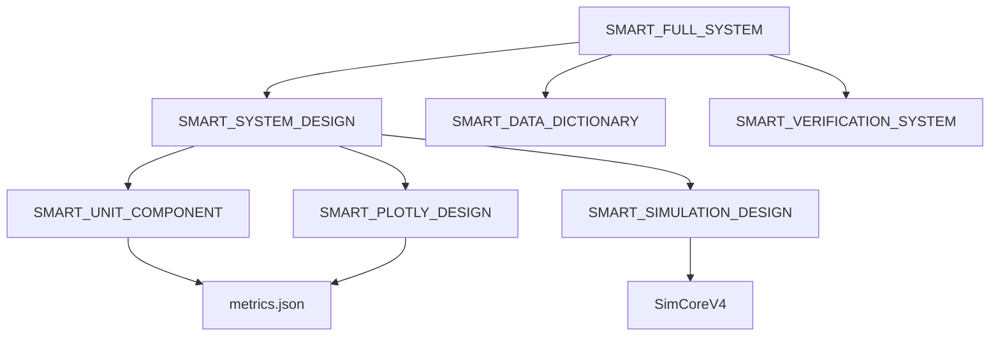

# Smart System - Master Index & File Structure

> **Smart System Master Index**  
> กำหนดขอบเขตไฟล์ที่ชัดเจน ไม่ให้ซ้อนทับ และตรวจสอบได้ง่าย  
> **Last Updated:** 2024-12-24

---

## 📁 Smart System Files (Complete)

### Documentation (7 ไฟล์)

| # | ไฟล์ | หน้าที่ | Size |
|---|------|--------|------|
| 1 | [SMART_FULL_SYSTEM.md](../SMART_FULL_SYSTEM.md) | **Master Overview** | 14KB |
| 2 | [SMART_SYSTEM_DESIGN.md](SMART_SYSTEM_DESIGN.md) | Parameters + DB Integration | 11KB |
| 3 | [SMART_UNIT_COMPONENT.md](SMART_UNIT_COMPONENT.md) | Unit Converter Button | 8KB |
| 4 | [SMART_PLOTLY_DESIGN.md](SMART_PLOTLY_DESIGN.md) | Charts & Visualization | 13KB |
| 5 | [SMART_SIMULATION_DESIGN.md](SMART_SIMULATION_DESIGN.md) | Simulation Engine + Control | 15KB |
| 6 | [SMART_SETTINGS_DESIGN.md](SMART_SETTINGS_DESIGN.md) | **Settings = Verification View** | 8KB |
| 7 | **SMART_INDEX.md** (ไฟล์นี้) | Master Index | 7KB |

### Platform Level (2 ไฟล์)

| # | ไฟล์ | หน้าที่ | Size |
|---|------|--------|------|
| 8 | [SMART_DATA_DICTIONARY.md](../SMART_DATA_DICTIONARY.md) | All Metrics + Units | 9KB |
| 9 | [SMART_VERIFICATION_SYSTEM.md](../SMART_VERIFICATION_SYSTEM.md) | L0-L5 Test Checklists | 10KB |

**Total: 9 Smart Documents (~95KB)**


---

## 📂 Source Code Structure

### Existing (✅)

```
frontend/src/
├── lib/registry/
│   ├── index.ts              ✅ MetricRegistryService
│   └── metrics.json          ✅ 20+ metric definitions
│
├── lib/equations/
│   ├── registry.ts           ✅ EquationRegistry
│   ├── types.ts              ✅ EquationModule interface
│   └── modules/              ✅ Newton, Einstein, UET
│
└── features/simulation/
    └── SimCoreV4.ts          ✅ Physics engine
```

### To Create (🔄)

```
frontend/src/
├── lib/smart/
│   ├── UnitConverter.ts      □ Conversion logic
│   ├── TelemetryBuffer.ts    □ Data buffering
│   ├── InvariantChecker.ts   □ Physics validation
│   ├── PresetManager.ts      □ Save/Load
│   └── ExportService.ts      □ JSON/CSV/PNG
│
├── stores/
│   ├── useUnitStore.ts       □ Unit preferences
│   └── useTelemetryStore.ts  □ Real-time data
│
└── components/smart/
    ├── SmartMetric.tsx       □ Unit converter row
    ├── ParameterCard.tsx     □ Parameter input
    ├── SmartChart.tsx        □ Plotly wrapper
    ├── SmartEquationSelector.tsx □ Equation picker
    ├── SmartSimControl.tsx   □ Play/Pause/Stop
    └── SmartWarning.tsx      □ Validation alerts
```

**Total Source Files: 14 (6 existing + 8 to create)**

---

## 🔗 Document Dependencies



---

## 🔒 Boundaries (ไม่ซ้อนทับ)

| Document | Covers | Does NOT Cover |
|----------|--------|----------------|
| SMART_SYSTEM_DESIGN | DB, Parameters, Auto-gen | Units, Charts |
| SMART_UNIT_COMPONENT | Unit dropdown, Conversion | Charts, Parameters |
| SMART_PLOTLY_DESIGN | All charts, Tooltips, Export | Units, Parameters |
| SMART_SIMULATION_DESIGN | Engine, Control, Preset | Units, Charts |
| SMART_DATA_DICTIONARY | All metrics, Units, Ranges | Code implementation |
| SMART_VERIFICATION_SYSTEM | L0-L5 Tests, CI/CD | Design details |

---

## ✅ Audit Checklist

### Documentation
```
✅ All 8 Smart docs exist
✅ All docs have cross-references
✅ SMART_FULL_SYSTEM is master overview
✅ SMART_INDEX has file structure
```

### Source Code
```
□ metrics.json has all 20+ metrics
□ All conversions in UnitConverter.ts
□ No hardcoded values in components
□ Stores initialized correctly
```

### Security
```
□ No eval() in UnitConverter
□ No secrets in metrics.json
□ Input sanitization in forms
□ localStorage with prefixed keys
```

---

## 🎯 Quick Reference

| Need To... | Go To |
|------------|-------|
| Understand whole Smart system | [SMART_FULL_SYSTEM](../SMART_FULL_SYSTEM.md) |
| Add/edit metrics | [SMART_DATA_DICTIONARY](../SMART_DATA_DICTIONARY.md) |
| Fix unit conversion | [SMART_UNIT_COMPONENT](SMART_UNIT_COMPONENT.md) |
| Fix charts | [SMART_PLOTLY_DESIGN](SMART_PLOTLY_DESIGN.md) |
| Fix simulation | [SMART_SIMULATION_DESIGN](SMART_SIMULATION_DESIGN.md) |
| Run tests | [SMART_VERIFICATION_SYSTEM](../SMART_VERIFICATION_SYSTEM.md) |
| Check parameters | [SMART_SYSTEM_DESIGN](SMART_SYSTEM_DESIGN.md) |

---

## 📝 Change Log

| Date | Change |
|------|--------|
| 2024-12-24 | Created SMART_FULL_SYSTEM.md |
| 2024-12-24 | Created SMART_VERIFICATION_SYSTEM.md |
| 2024-12-24 | Created SMART_SIMULATION_DESIGN.md |
| 2024-12-24 | Updated all docs with cross-refs |
| 2024-12-24 | Updated SMART_INDEX to 8 docs |

---

> **This is the definitive index for Smart System files.**
> All Smart files must be listed here.
