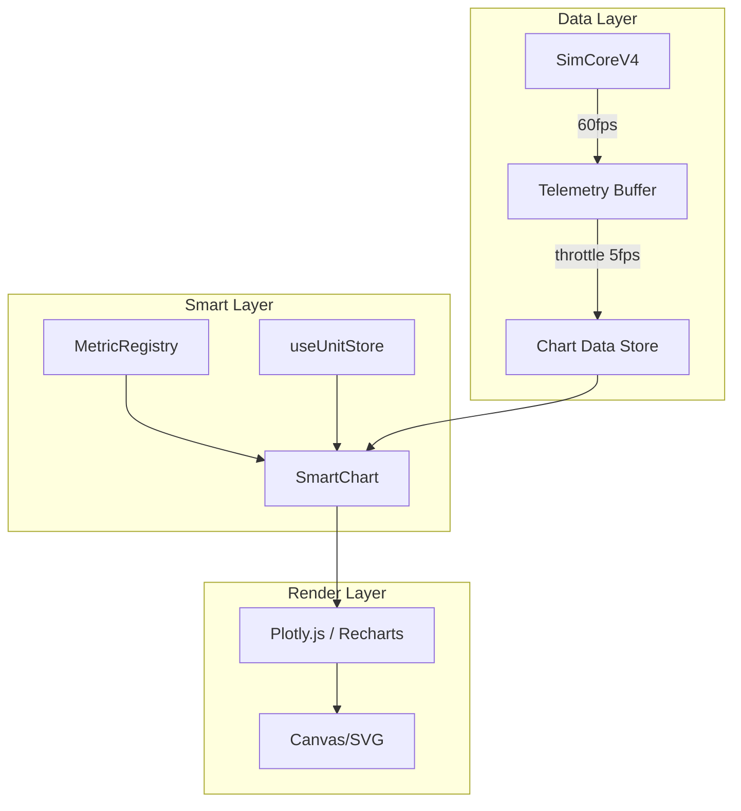

# Smart Plotly/Chart Visualization Design

> **Related Documents:**
> - [SMART_SYSTEM_DESIGN](SMART_SYSTEM_DESIGN.md) ← Smart Parameter System
> - [SMART_UNIT_COMPONENT](SMART_UNIT_COMPONENT.md) ← Unit Converter
> - [UNIT_SYSTEM_ARCHITECTURE](../UNIT_SYSTEM_ARCHITECTURE.md) ← Full Pipeline
> - [DATA_DICTIONARY](../standards/DATA_DICTIONARY.md) ← Metric Definitions

> **Goal:** Create a Smart visualization system that automatically adapts to:
> - User's unit preferences
> - Selected metrics from database
> - Real-time simulation data
> - Interactive zoom/pan/export

---

## 1. ภาพรวม Smart Chart System

### 1.1 Core Features

| Feature | Description |
|---------|-------------|
| **Unit-Aware Axes** | Y-axis label และ tick values เปลี่ยนตาม unit ที่ user เลือก |
| **Auto-Grouping** | Metrics ใน plot_group เดียวกัน overlay ใน chart เดียว |
| **Real-time Update** | รับ data จาก simulation ที่ 60fps ลดลงเหลือ 5fps สำหรับ render |
| **Interactive** | Zoom, Pan, Hover tooltips, Click to focus |
| **Export** | PNG, SVG, CSV, JSON |
| **Responsive** | ปรับขนาดตาม container |

### 1.2 Architecture



---

## 2. Database Integration

### 2.1 Metric Definition for Charts

```json
{
  "metric_id": "total_energy",
  "label": "Total Energy",
  "symbol": "E",
  "unit": "J",
  "plot_group": "energy_group",
  "chart_config": {
    "color": "#4ecdc4",
    "line_style": "solid",
    "default_visible": true,
    "y_axis": "left",
    "format": "scientific"
  }
}
```

### 2.2 Plot Group Definition

```json
{
  "plot_groups": {
    "energy_group": {
      "label": "Energy",
      "y_axis_label": "Energy (J)",
      "overlay_allowed": true,
      "color_palette": ["#4ecdc4", "#ff6b6b", "#ffd93d"]
    },
    "uet_group": {
      "label": "UET Fields",
      "y_axis_label": "Ω (UET units)",
      "overlay_allowed": true,
      "color_palette": ["#45b7d1", "#96ceb4", "#ffeaa7"]
    }
  }
}
```

---

## 3. Smart Chart Component

### 3.1 Component Props

```typescript
interface SmartChartProps {
  // Metrics to display (from user selection)
  metricIds: string[];
  
  // Data source
  data: TelemetryPoint[];
  
  // Chart type
  type?: 'line' | 'scatter' | 'area' | 'bar';
  
  // Optional overrides
  height?: number;
  showLegend?: boolean;
  showGrid?: boolean;
  enableZoom?: boolean;
  enableExport?: boolean;
}

interface TelemetryPoint {
  t: number;           // Time
  step: number;        // Step count
  [metricId: string]: number;  // Dynamic metric values
}
```

### 3.2 Full Implementation

```typescript
import Plot from 'react-plotly.js';
import { metricRegistry } from '@/lib/registry';
import { useUnitStore } from '@/stores/useUnitStore';
import { unitConverter } from '@/lib/UnitConverter';

function SmartChart({ 
  metricIds, 
  data, 
  type = 'line',
  height = 300,
  showLegend = true,
  enableZoom = true,
  enableExport = true
}: SmartChartProps) {
  const { getPreference } = useUnitStore();
  
  // Group metrics by plot_group for overlay
  const groups = useMemo(() => {
    return metricRegistry.groupMetricsByPlotGroup(metricIds);
  }, [metricIds]);
  
  // Build traces for each metric
  const traces = useMemo(() => {
    return metricIds.map((id, index) => {
      const metric = metricRegistry.getMetric(id);
      const userUnit = getPreference(id) || metric.unit;
      const unitLabel = getUnitLabel(userUnit);
      
      return {
        name: `${metric.label} (${unitLabel})`,
        x: data.map(d => d.t),
        y: data.map(d => unitConverter.convert(d[id], metric.unit, userUnit)),
        type: type === 'area' ? 'scatter' : type,
        fill: type === 'area' ? 'tozeroy' : undefined,
        mode: type === 'line' ? 'lines' : 'markers',
        line: {
          color: metric.chart_config?.color || COLORS[index % COLORS.length],
          width: 2
        },
        hovertemplate: `%{y:.4g} ${unitLabel}<extra>${metric.label}</extra>`
      };
    });
  }, [metricIds, data, getPreference]);
  
  // Build layout with smart axis labels
  const layout = useMemo(() => {
    const primaryMetric = metricRegistry.getMetric(metricIds[0]);
    const userUnit = getPreference(metricIds[0]) || primaryMetric?.unit || '';
    const plotGroup = metricRegistry.getPlotGroup(primaryMetric?.plot_group);
    
    return {
      height,
      margin: { l: 60, r: 20, t: 20, b: 40 },
      paper_bgcolor: 'rgba(0,0,0,0)',
      plot_bgcolor: 'rgba(0,0,0,0)',
      font: { color: '#ffffff', family: 'Inter' },
      xaxis: {
        title: 'Time (s)',
        gridcolor: 'rgba(255,255,255,0.1)',
        zerolinecolor: 'rgba(255,255,255,0.2)'
      },
      yaxis: {
        title: `${plotGroup?.label || 'Value'} (${userUnit})`,
        gridcolor: 'rgba(255,255,255,0.1)',
        zerolinecolor: 'rgba(255,255,255,0.2)',
        exponentformat: 'e'
      },
      legend: showLegend ? {
        x: 0,
        y: 1.1,
        orientation: 'h',
        bgcolor: 'rgba(0,0,0,0.5)'
      } : undefined,
      dragmode: enableZoom ? 'zoom' : false
    };
  }, [metricIds, height, showLegend, enableZoom, getPreference]);
  
  // Config for interactivity
  const config = useMemo(() => ({
    displayModeBar: enableExport,
    modeBarButtonsToRemove: ['lasso2d', 'select2d'],
    toImageButtonOptions: {
      format: 'png',
      filename: `chart_${Date.now()}`,
      height: 600,
      width: 1200
    },
    responsive: true
  }), [enableExport]);
  
  return (
    <Plot
      data={traces}
      layout={layout}
      config={config}
      useResizeHandler
      style={{ width: '100%', height: '100%' }}
    />
  );
}
```

---

## 4. Real-time Data Flow

### 4.1 Throttling Strategy

```typescript
// Problem: Simulation runs at 60fps, chart can't render that fast
// Solution: Buffer + Throttle

class TelemetryBuffer {
  private buffer: TelemetryPoint[] = [];
  private maxPoints = 500;  // Keep last 500 points
  
  push(point: TelemetryPoint) {
    this.buffer.push(point);
    if (this.buffer.length > this.maxPoints) {
      this.buffer.shift();
    }
  }
  
  getThrottled(fps: number = 5): TelemetryPoint[] {
    // Return subset of points for rendering
    const interval = 1 / fps;  // seconds
    return this.buffer.filter((p, i) => 
      i === 0 || p.t - this.buffer[i-1].t >= interval
    );
  }
}

// Zustand store
export const useTelemetryStore = create<{
  buffer: TelemetryBuffer;
  chartData: TelemetryPoint[];
}>((set, get) => ({
  buffer: new TelemetryBuffer(),
  chartData: [],
  
  // Called by simulation at 60fps
  pushPoint: (point: TelemetryPoint) => {
    get().buffer.push(point);
  },
  
  // Called by chart at 5fps
  updateChartData: () => {
    set({ chartData: get().buffer.getThrottled(5) });
  }
}));
```

### 4.2 Performance Optimization

| Technique | Description |
|-----------|-------------|
| **Throttle Render** | 5fps สำหรับ chart (ไม่ต้อง 60fps) |
| **WebGL Renderer** | ใช้ Plotly WebGL สำหรับ >1000 points |
| **Data Downsampling** | ลดจุด data เมื่อ zoom out |
| **Memoization** | useMemo สำหรับ traces และ layout |
| **Virtual Scrolling** | ถ้ามีหลาย charts |

---

## 5. Interactive Features

### 5.1 Hover Tooltip (Smart Unit)

```typescript
// Tooltip shows converted value with unit
hovertemplate: `
  <b>${metric.label}</b><br>
  Time: %{x:.2f} s<br>
  Value: %{y:.4g} ${userUnit}<br>
  <extra></extra>
`
```

### 5.2 Click to Focus

```typescript
// Focus on single metric
const handleClick = (event: PlotMouseEvent) => {
  const clickedMetric = metricIds[event.points[0].curveNumber];
  setFocusedMetric(clickedMetric);
  // Hide other traces temporarily
};
```

### 5.3 Range Selector

```typescript
// Add range buttons
layout.xaxis.rangeselector = {
  buttons: [
    { count: 1, label: '1s', step: 'second', stepmode: 'backward' },
    { count: 10, label: '10s', step: 'second', stepmode: 'backward' },
    { count: 1, label: '1m', step: 'minute', stepmode: 'backward' },
    { step: 'all', label: 'All' }
  ],
  bgcolor: 'rgba(0,0,0,0.5)',
  activecolor: '#4ecdc4'
};
```

### 5.4 Export Options

```typescript
const exportMenu = [
  { label: 'PNG', action: () => Plotly.downloadImage(ref, { format: 'png' }) },
  { label: 'SVG', action: () => Plotly.downloadImage(ref, { format: 'svg' }) },
  { label: 'CSV', action: () => exportCSV(data, metricIds) },
  { label: 'JSON', action: () => exportJSON(data, metricIds) }
];

function exportCSV(data: TelemetryPoint[], metricIds: string[]) {
  const headers = ['t', 'step', ...metricIds].join(',');
  const rows = data.map(d => 
    [d.t, d.step, ...metricIds.map(id => d[id])].join(',')
  );
  downloadFile([headers, ...rows].join('\n'), 'telemetry.csv', 'text/csv');
}
```

---

## 6. Chart Types

### 6.1 Line Chart (Default)
```
│    ╭──╮
│   ╱    ╲╭──╮
│  ╱      ╲  ╲
│ ╱        ╲  ╲
└──────────────→ t
```
**Use:** Time series, energy evolution

### 6.2 Multi-Axis Chart
```
E(J) │        ○○○    │ Ω
     │     ●●●●●     │
     │  ●●●     ○○○  │
     │●●           ○○│
     └───────────────┤
                    t
```
**Use:** Compare metrics with different units

### 6.3 Surface Plot (3D)
```
     ╱╲    ╱╲
    ╱  ╲  ╱  ╲
   ╱    ╲╱    ╲
  ╱      ╳     ╲
```
**Use:** C-Field visualization, phase space

### 6.4 Heatmap
```
┌────────────────┐
│ ▓▓░░░░▓▓▓▓▓▓▓ │
│ ▓▓▓░░░░░▓▓▓▓▓ │
│ ▓▓▓▓░░░░░▓▓▓▓ │
└────────────────┘
```
**Use:** Field density, stability matrix

---

## 7. GraphDock Component

### 7.1 Layout

```
┌─────────────────────────────────────────────────────┐
│ ▼ Collapse │ LIVE TELEMETRY (Last 200 pts) │ × Clear │
├─────────────────────────────────────────────────────┤
│                                                     │
│    [SmartChart with selected metrics]               │
│                                                     │
├─────────────────────────────────────────────────────┤
│ [✓ Energy] [✓ Momentum] [○ Ω] [○ κ] │ [Export ▾] │
└─────────────────────────────────────────────────────┘
```

### 7.2 Metric Selector Row

```typescript
function MetricSelectorRow({ availableMetrics, selectedIds, onChange }) {
  return (
    <div className="flex gap-2 overflow-x-auto">
      {availableMetrics.map(metric => (
        <button
          key={metric.metric_id}
          onClick={() => toggleMetric(metric.metric_id)}
          className={cn(
            "px-3 py-1 rounded-full text-xs",
            selectedIds.includes(metric.metric_id)
              ? "bg-cyan-500/30 text-cyan-400"
              : "bg-white/10 text-gray-400"
          )}
        >
          {selectedIds.includes(metric.metric_id) ? '✓ ' : '○ '}
          {metric.label}
        </button>
      ))}
    </div>
  );
}
```

---

## 8. Implementation Checklist

### Core
- [ ] Install `react-plotly.js` and `plotly.js`
- [ ] Create `SmartChart.tsx` component
- [ ] Create `TelemetryBuffer` class
- [ ] Create `useTelemetryStore` Zustand store

### Features
- [ ] Unit-aware axis labels
- [ ] Auto-grouping by plot_group
- [ ] Hover tooltips with converted values
- [ ] Range selector buttons
- [ ] Export menu (PNG, SVG, CSV, JSON)

### Performance
- [ ] Throttle render to 5fps
- [ ] Enable WebGL for large datasets
- [ ] Memoize traces and layout
- [ ] Downsample on zoom out

### Integration
- [ ] Connect to SimCoreV4 telemetry
- [ ] Read config from MetricRegistry
- [ ] Sync with useUnitStore preferences
- [ ] Add to GraphDock component
