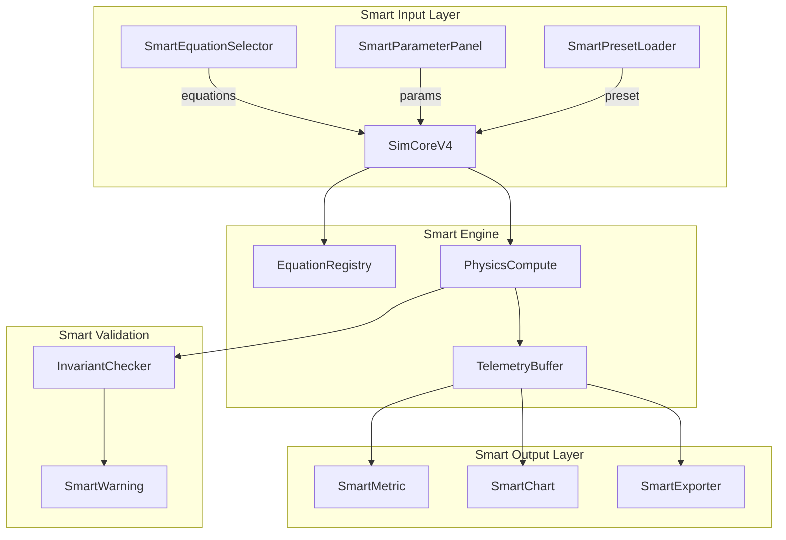
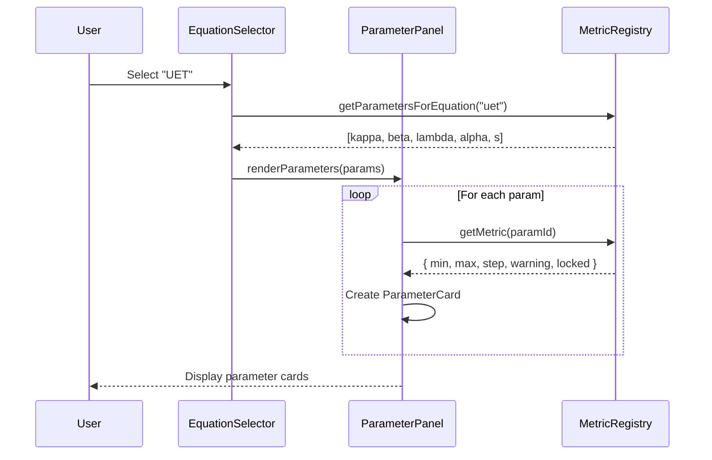
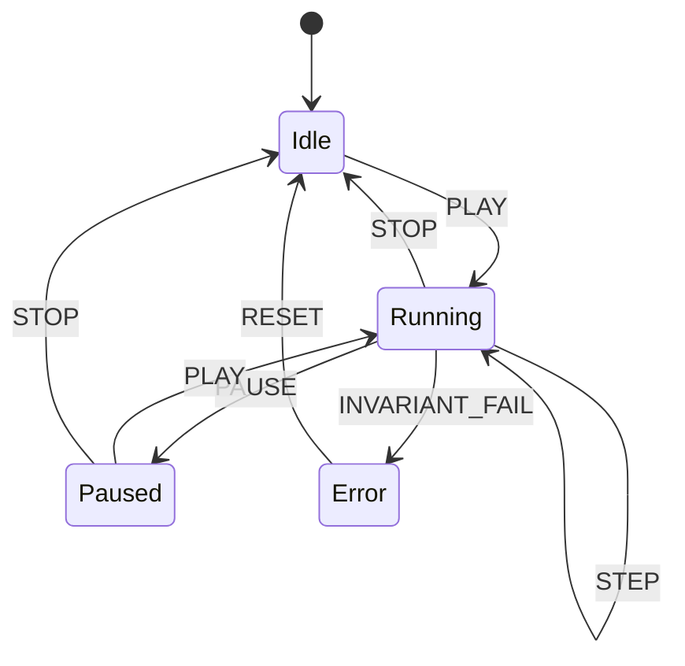
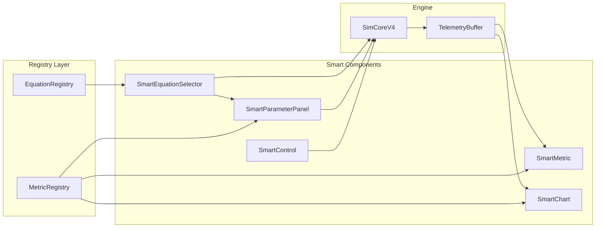

# Smart Simulation System Design

> **Related Documents:**
> - [SMART_INDEX](SMART_INDEX.md) ← Smart System Master
> - [SMART_DATA_DICTIONARY](../SMART_DATA_DICTIONARY.md) ← All Metrics
> - [SMART_SYSTEM_DESIGN](SMART_SYSTEM_DESIGN.md) ← Parameters
> - [SMART_UNIT_COMPONENT](SMART_UNIT_COMPONENT.md) ← Unit Converter
> - [SMART_PLOTLY_DESIGN](SMART_PLOTLY_DESIGN.md) ← Charts

> **Goal:** สร้างระบบ Simulation ที่ฉลาด เชื่อมโยงทุก Smart component

---

## 1. ภาพรวม Smart Simulation

### 1.1 Core Concept



### 1.2 Smart Features

| Feature | Description | Status |
|---------|-------------|--------|
| **Smart Equations** | Auto-load parameters when equation selected | 🔄 |
| **Smart Parameters** | Validate ranges, show warnings | 🔄 |
| **Smart Units** | Convert display without affecting physics | ✅ Design |
| **Smart Charts** | Unit-aware, real-time throttled | ✅ Design |
| **Smart Presets** | Save/Load full simulation state | 🔄 |
| **Smart Validation** | Real-time physics invariant checks | 🔄 |
| **Smart Export** | Multiple formats with metadata | 🔄 |

---

## 2. Smart Equation Selector

### 2.1 UI Design

```
┌─────────────────────────────────────────────────────────┐
│ ACTIVE EQUATIONS                               [+ Add]  │
├─────────────────────────────────────────────────────────┤
│ ┌─────────────────────────────────────────────────────┐ │
│ │ ⚡ Newton Gravity              [Driver ▾] [✓ On]    │ │
│ │    G = 6.674e-11 m³/kg·s²                          │ │
│ └─────────────────────────────────────────────────────┘ │
│ ┌─────────────────────────────────────────────────────┐ │
│ │ 🌊 UET Field Theory           [Observer ▾] [○ Off]  │ │
│ │    κ=0.3, β=0.5, λ=0.1                             │ │
│ └─────────────────────────────────────────────────────┘ │
│ ┌─────────────────────────────────────────────────────┐ │
│ │ ⚠️ Coupling Warning: Newton ↔ UET may conflict     │ │
│ └─────────────────────────────────────────────────────┘ │
└─────────────────────────────────────────────────────────┘
```

### 2.2 Smart Behaviors

| Behavior | Trigger | Action |
|----------|---------|--------|
| **Auto-load params** | Select equation | Generate ParameterCards |
| **Compatibility check** | Select 2+ equations | Show warning if conflict |
| **Parameter sync** | Change shared param | Update all equations |
| **Role assignment** | Select role | Update equation behavior |

### 2.3 Component Code

```typescript
interface SmartEquationSelectorProps {
  onEquationsChange: (equations: ActiveEquation[]) => void;
}

interface ActiveEquation {
  id: string;
  role: 'driver' | 'observer' | 'coupled';
  enabled: boolean;
  params: Record<string, number>;
}

function SmartEquationSelector({ onEquationsChange }: SmartEquationSelectorProps) {
  const [activeEquations, setActiveEquations] = useState<ActiveEquation[]>([]);
  const registry = useEquationRegistry();
  
  // Smart: Check compatibility when equations change
  useEffect(() => {
    const warnings = checkCompatibility(activeEquations);
    if (warnings.length > 0) {
      showWarnings(warnings);
    }
  }, [activeEquations]);
  
  // Smart: Auto-load parameters
  const addEquation = (equationId: string) => {
    const equation = registry.get(equationId);
    const defaultParams = equation.parameters.reduce((acc, p) => {
      const metric = metricRegistry.getMetric(p);
      acc[p] = metric.defaultValue;
      return acc;
    }, {});
    
    setActiveEquations(prev => [...prev, {
      id: equationId,
      role: 'observer',
      enabled: true,
      params: defaultParams
    }]);
  };
  
  return (
    <div className="smart-equation-selector">
      {activeEquations.map(eq => (
        <EquationCard 
          key={eq.id}
          equation={eq}
          onRoleChange={(role) => updateRole(eq.id, role)}
          onToggle={(enabled) => updateEnabled(eq.id, enabled)}
          onParamsChange={(params) => updateParams(eq.id, params)}
        />
      ))}
      <AddEquationButton onAdd={addEquation} />
      <CompatibilityWarnings equations={activeEquations} />
    </div>
  );
}
```

---

## 3. Smart Parameter Panel

### 3.1 Dynamic Parameter Generation



### 3.2 Parameter Card Types

| Type | Visual | Behavior |
|------|--------|----------|
| **Slider** | `[====●=====]` | Continuous adjustment |
| **Fixed** | `299,792,458 🔒` | Read-only constant |
| **Input** | `[___10.0___]` | Free text entry |
| **Computed** | `N = T/dt = 1000 🔄` | Auto-calculated |
| **Warning** | `⚠️ λ=0 unstable` | Alert when dangerous |

### 3.3 Smart Validation

```typescript
interface ValidationRule {
  condition: string;      // "value === 0"
  level: 'info' | 'warn' | 'error';
  message: string;
}

const validationRules: Record<string, ValidationRule[]> = {
  lambda: [
    { condition: "value === 0", level: "warn", message: "λ=0 disables field interaction" },
    { condition: "value > 0.5", level: "info", message: "High λ increases computation" }
  ],
  dt: [
    { condition: "value > 0.1", level: "error", message: "dt too large, simulation unstable" },
    { condition: "value < 1e-6", level: "warn", message: "dt very small, slow simulation" }
  ],
  kappa: [
    { condition: "value > 1.5", level: "warn", message: "High κ may cause instability" }
  ]
};
```

---

## 4. Smart Simulation Control

### 4.1 Control Panel UI

```
┌─────────────────────────────────────────────────────────┐
│  ▶ PLAY  │ ⏸ PAUSE │ ⏹ STOP │ ↺ RESET │ 📷 SNAPSHOT │
├─────────────────────────────────────────────────────────┤
│  t = 10.50s    │  N = 1050 steps   │  dt = 0.01s      │
├─────────────────────────────────────────────────────────┤
│  Speed: [0.5x] [1x] [2x] [5x] [Max]                    │
├─────────────────────────────────────────────────────────┤
│  Status: ● Running   │  FPS: 60   │  Health: ✅ STABLE │
└─────────────────────────────────────────────────────────┘
```

### 4.2 State Machine



### 4.3 Health Monitoring

```typescript
interface SimulationHealth {
  status: 'stable' | 'warning' | 'critical' | 'failed';
  checks: {
    energyDrift: { value: number; threshold: number; passed: boolean };
    momentumDrift: { value: number; threshold: number; passed: boolean };
    nanDetected: boolean;
    infDetected: boolean;
  };
  lastCheck: number; // timestamp
}

function checkSimulationHealth(state: WorldState): SimulationHealth {
  const energyDrift = Math.abs((state.totalEnergy - state.initialEnergy) / state.initialEnergy);
  const momentumDrift = vec3Length(state.totalMomentum);
  
  return {
    status: determineStatus(energyDrift, momentumDrift),
    checks: {
      energyDrift: { value: energyDrift, threshold: 1e-6, passed: energyDrift < 1e-6 },
      momentumDrift: { value: momentumDrift, threshold: 1e-10, passed: momentumDrift < 1e-10 },
      nanDetected: hasNaN(state),
      infDetected: hasInf(state)
    },
    lastCheck: Date.now()
  };
}
```

---

## 5. Smart Preset System

### 5.1 Preset Structure

```json
{
  "id": "solar_system_default",
  "name": "Solar System",
  "version": "1.0.0",
  "created": "2024-12-24T00:00:00Z",
  
  "equations": [
    { "id": "newton", "role": "driver", "enabled": true }
  ],
  
  "parameters": {
    "G": 6.674e-11,
    "dt": 86400,
    "softening": 1e9
  },
  
  "bodies": [
    { "name": "Sun", "mass": 1.989e30, "position": [0,0,0], "velocity": [0,0,0] },
    { "name": "Earth", "mass": 5.972e24, "position": [1.496e11,0,0], "velocity": [0,29783,0] }
  ],
  
  "viewSettings": {
    "cameraPosition": [0, 5e11, 5e11],
    "targetBody": "Sun",
    "visibleMetrics": ["total_energy", "angular_momentum"]
  },
  
  "unitPreferences": {
    "mass": "suns",
    "distance": "AU",
    "time": "days"
  }
}
```

### 5.2 Preset Actions

| Action | Description | API |
|--------|-------------|-----|
| **Save Current** | Save current state as preset | `POST /api/presets` |
| **Load Preset** | Load and apply preset | `GET /api/presets/{id}` |
| **Share Preset** | Generate shareable link | `POST /api/presets/{id}/share` |
| **Fork Preset** | Copy and modify | `POST /api/presets/{id}/fork` |

---

## 6. Smart Export System

### 6.1 Export Formats

| Format | Content | Use Case |
|--------|---------|----------|
| **JSON** | Full state + telemetry | Backup, API |
| **CSV** | Time series data | Analysis, Excel |
| **PNG** | Current frame screenshot | Report |
| **MP4** | Animation recording | Presentation |
| **HTML** | Interactive report | Sharing |

### 6.2 Export Configuration

```typescript
interface ExportConfig {
  format: 'json' | 'csv' | 'png' | 'mp4' | 'html';
  
  // Data selection
  includeState: boolean;      // Full simulation state
  includeTelemetry: boolean;  // Time series data
  includePreset: boolean;     // Settings to recreate
  
  // Time range (for CSV/MP4)
  startTime?: number;
  endTime?: number;
  
  // Quality (for PNG/MP4)
  resolution?: '720p' | '1080p' | '4k';
  fps?: number;
  
  // Unit preferences (for CSV)
  useDisplayUnits: boolean;   // Convert or keep SI
}
```

---

## 7. Integration Map

### 7.1 Component Dependencies



### 7.2 Data Flow

```
User Action → Smart Component → SimCoreV4 → Telemetry → Smart Display
     ↑                                            ↓
     └──────────── Unit Conversion ────────────────┘
```

---

## 8. Implementation Checklist

### Phase 1: Core Smart Components
- [ ] `SmartEquationSelector.tsx`
- [ ] `SmartParameterPanel.tsx`
- [ ] `SmartSimControl.tsx`

### Phase 2: Smart Validation
- [ ] `InvariantChecker.ts`
- [ ] `SimulationHealth.ts`
- [ ] `SmartWarning.tsx`

### Phase 3: Smart Preset
- [ ] `PresetManager.ts`
- [ ] `PresetCard.tsx`
- [ ] API endpoints

### Phase 4: Smart Export
- [ ] `ExportService.ts`
- [ ] `ExportModal.tsx`
- [ ] Format converters

---

## 9. File Structure

```
frontend/src/
├── components/smart/
│   ├── SmartEquationSelector.tsx
│   ├── SmartParameterPanel.tsx
│   ├── SmartSimControl.tsx
│   ├── SmartMetric.tsx           # (existing)
│   ├── SmartChart.tsx            # (existing)
│   ├── ParameterCard.tsx         # (existing)
│   └── SmartWarning.tsx
│
├── lib/smart/
│   ├── UnitConverter.ts          # (existing)
│   ├── TelemetryBuffer.ts        # (existing)
│   ├── InvariantChecker.ts
│   ├── SimulationHealth.ts
│   ├── PresetManager.ts
│   └── ExportService.ts
│
└── features/simulation/
    ├── SimCoreV4.ts              # (existing)
    ├── EquationRegistry.ts       # (existing)
    └── SmartSimulation.tsx       # Main container
```

---

> **Total Smart System Files: 14**
> - Components: 7
> - Libraries: 6
> - Container: 1
