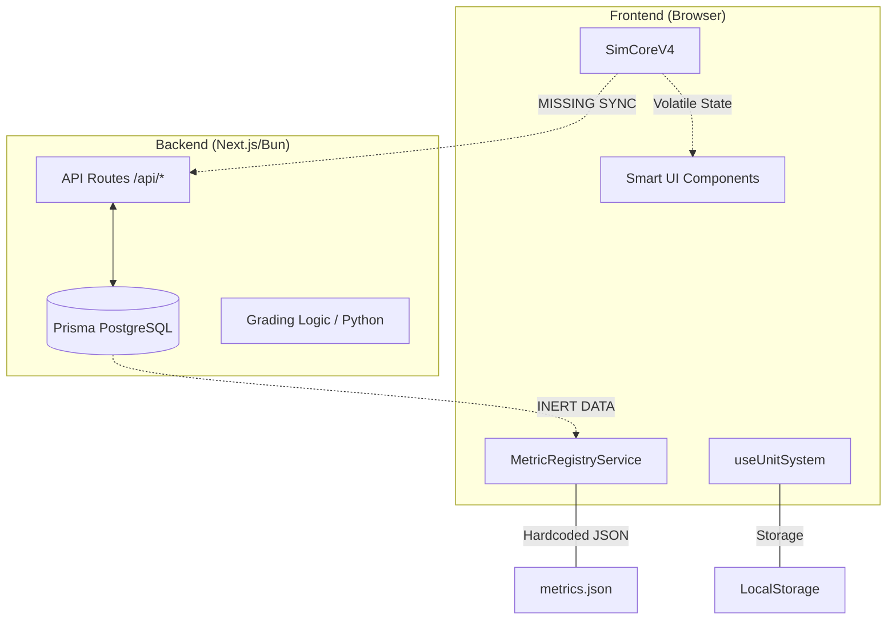

# Smart System: Full-Stack Integration Map

This document bridges the gap between the **Frontend (Browser Runtime)** and the **Backend (Database/API)**.

## 1. System Topology

## 2. Component Synchronization Status

| Feature Component | Frontend Source | Backend Source | Connection Status |
|-------------------|-----------------|----------------|-------------------|
| **Metrics List** | `metrics.json` | `MetricRegistry` table | 🔴 De-synced |
| **Equation Modules** | `./equations/*.ts` | `EquationModule` table | 🔴 De-synced |
| **Simulation Runs** | Local Proxy ID | `Run` table | 🔴 Not Persisted |
| **Unit Preferences** | LocalStorage | N/A | 🔴 Local Only |
| **Run Metadata** | Local JS state | `metadata` JSON in DB | 🔴 Not Syncing |
| **Project Archiving** | `config` JSON | `Project` table | 🟡 Partial |

## 3. High-Priority Inconsistencies

### 3.1 Hardcoded vs Dynamic Catalog
- **Issue**: The UI displays Equations and Metrics from hardcoded JSON/TS files.
- **Backend Capability**: The database already has tables to store this metadata.
- **Risk**: Adding a new metric (e.g., "Angular Momentum") requires a frontend re-deploy instead of a database update.

### 3.2 Volatile Simulation Engine
- **Issue**: `SimCoreV4` calculates physics at 60FPS but doesn't "flush" any data to the backend.
- **Backend Capability**: `TelemetrySample` and `Snapshot` tables are ready to store this.
- **Risk**: Users cannot perform longitudinal analysis or re-open a simulation state once the tab is closed.

### 3.3 Grading Engine Disconnect
- **Issue**: The backend uses Python scripts for grading stability, while the frontend HUD calculates its own "Physics Health" in JS.
- **Risk**: A simulation might show "STABLE" in the browser but be marked "FAIL" by the backend grading script due to different tolerances.

## 4. Recommendations for Convergence

1.  **Smart API Foundation**:
    - Implement `GET /api/registry` to return the union of Metrics + Equations.
    - Update `MetricRegistryService` to fetch from this API with a local fallback.

2.  **Telemetry Sync Loop**:
    - Add a background `fetch` in `SimCoreV4` that `POST`s summary snapshots every 5 seconds to `/api/runs/{id}/telemetry`.

3.  **Unified State Persistence**:
    - Add a `UserPreference` table to store unit lens settings and UI layout preferences.
