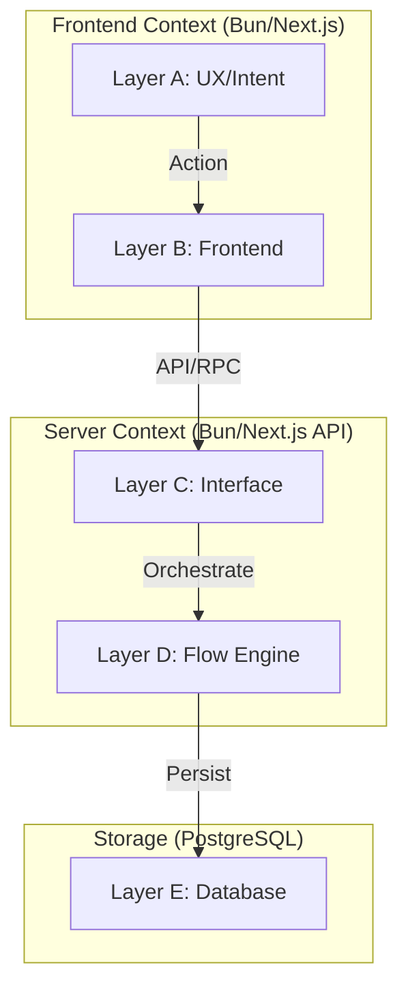
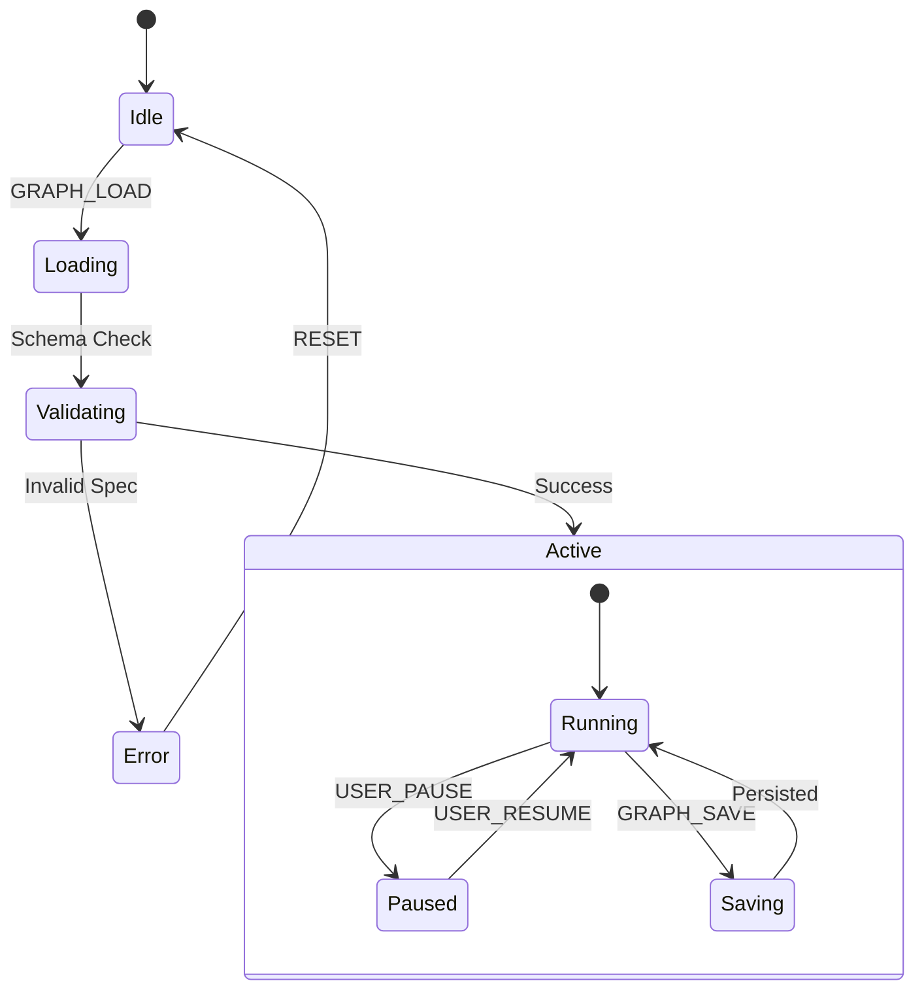
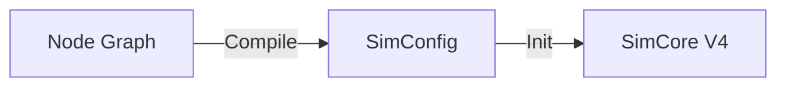

# Node Canvas Architecture (v2.0 Best Version)
## "Everything is a Node" - System Graph View

**Version:** 2.0 (Best Version)
**Last Updated:** 2025-12-25
**Layer:** D (Flow/Engine)

---

# 1. Architecture Overview (The 5-Layer Stack)

The architecture follows strict **Deep Clean Flow (DCF)** principles, separating concerns into 5 distinct layers.



---

# 2. Core Principle: Universal Node Protocol

```
Canvas = Circuit Board (System Graph)
Node   = Component (Logic Unit)
Edge   = Data Flow (Reactive Stream)
```

## 2.1 Zero Exceptions — Node Categories

| Category | Node Types | Layer | Context |
|:---------|:-----------|:------|:--------|
| **Simulation** | `sim-driver`, `equation`, `integrator` | D | Lab Canvas |
| **Visualization** | `plot`, `metric` | B→D | Lab Canvas |
| **Tooling** | `terminal`, `ai-chat`, `note` | B | Lab Canvas |
| **Persistence** | `db-save`, `export` | D→E | Lab Canvas |
| **System/Auth** | `system-auth`, `system-session` | C | Dev Canvas |
| **System/API** | `system-api`, `system-route` | C | Dev Canvas |
| **System/Store** | `system-store`, `system-context` | B | Dev Canvas |
| **System/Database** | `system-db`, `system-model` | E | Dev Canvas |
| **System/Test** | `system-test`, `system-gate` | D | Dev Canvas |
| **System/Layer** | `system-layer-a` through `system-layer-e` | All | Dev Canvas |

> **Rule:** Every platform component MUST be representable as a node.
> - Lab Canvas (`/lab`): Simulation nodes
> - Dev Canvas (`/dev`): Platform system nodes

---

# 3. OSS Stack (Modern & Performant)

| Layer | Technology | Role | Status | Notes |
|-------|------------|------|--------|-------|
| **Runtime** | **Bun** | Core Runtime | ✅ Implemented | 3x faster startup |
| **Canvas** | React Flow | UI Engine | ✅ Implemented | Virtualized rendering |
| **Layout** | Elkjs | Auto-Layout | ⏳ Planned | Manual positioning now |
| **Sync** | Fast-JSON-Patch | State Sync | ⏳ Planned | Full state updates now |

> **Note:** Elkjs and Fast-JSON-Patch are planned optimizations, not currently implemented.

---

# 4. Node Contract (Strict Typing)

```typescript
interface NodeSpec {
  // Identities
  id: string;
  type: NodeType;
  
  // I/O Contracts
  inputs: Port[];   // Strict typed (Vector3, Matrix, etc.)
  outputs: Port[];  // No "any" types allowed
  
  // Execution Policy
  updateMode: 'event' | 'tick' | 'frame'; // Optimized scheduling
  cost: CostSpec;   // Performance budgeting
}
```

## 4.1 Port Type Validation ✅ Implemented

When connecting nodes, port types are validated at runtime:

```typescript
// CanvasView.tsx onConnect handler
if (sourcePort.type !== targetPort.type) {
  alert(`Cannot connect: ${sourcePort.type} → ${targetPort.type}`);
  return; // Reject connection
}
```

| Port Type | Example Usage |
|:----------|:--------------|
| `number` | Scalar values |
| `vector3` | Positions, velocities |
| `particles` | WorldState |
| `telemetry` | MetricStream |

---

# 5. Graph Lifecycle (State Machine)

To ensure stability, the graph execution follows a strict state machine:



---

# 6. The Controller Pattern (Overlays)

> **Gap Resolution:** "Are Panels Nodes?" -> No, they are **Global Controllers**.

While "Everything is a Node" (Section 2), we use **Smart Panels** (Layer B) as **Controllers** to manipulate the graph from a higher level of abstraction.

*   **The Nodes (Actors):** Do the work (Physics, Plotting, AI).
*   **The Panels (Controllers):** Adjust the settings (Global Parameters, Room Switching).

## 6.1 Architecture Relationship
```mermaid
graph TD
    User -->|Interacts| CP[Smart Panel (Controller)]
    CP -->|RPC/Store| NG[Node Graph (Actors)]
    NG -->|Feedback| CP
```
*The Panel lives **ABOVE** the Graph, not inside it.*


---

# 7. The Graph Compiler (Bridge D) ⚠️ PARTIAL

> **Gap Resolution:** How does a Node Graph become a running simulation?

The **Graph Compiler** translates the visual `NodeGraph` into the Engine's `SimConfig`.

## 7.1 Implementation Status

| Feature | Status | Notes |
|:--------|:-------|:------|
| Equation extraction | ✅ | From `type: 'equation'` nodes |
| UET core injection | ✅ | Always included |
| Param extraction | ⏳ Planned | Uses hardcoded dt=0.016 |
| Role from topology | ⏳ Planned | Always `'coupled'` |
| Body nodes → state | ⏳ Planned | Uses fallback preset |

## 7.2 Compilation Logic

```typescript
type Compiler = (graph: NodeGraph) => SimConfig;
```

1.  **Preset Identification:**
    *   If graph metadata contains `presetId`, use it as base.
    *   Else, default to fallback preset. ✅ Implemented
2.  **Equation Extraction:**
    *   Find nodes with `type: 'equation'`. ✅ Implemented
    *   Map `spec.id` to `moduleId`. ✅ Implemented
    *   Determine role based on topology. ⏳ Planned (hardcoded now)
3.  **Parameter Extraction:**
    *   Extract params from Node `data`. ⏳ Planned
    *   Override `SimConfig.simParams`. ⏳ Planned

## 7.3 Data Flow



---

# 10. UX Integration & Action IDs

**Constraint (R2.1):** All interactions MUST use `data-action-id`.

| Toggle | Save | Load | Browser |
|--------|------|------|---------|
| `view_toggle` | `graph_save` | `graph_load_latest` | `graph_browse` |

---

**Status:** ✅ SPEC LOCKED (v2.0)
