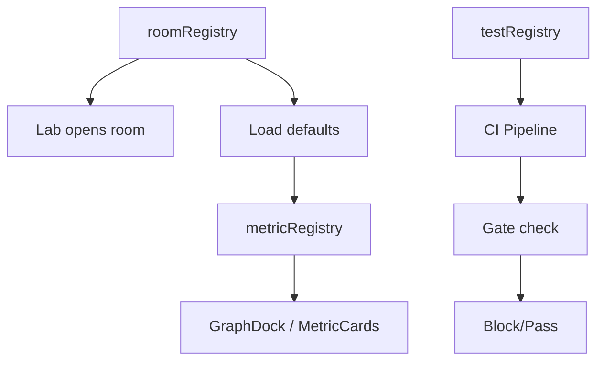

# Registries Specification
## UET Platform - Registry Definitions v1.0

**Last Updated:** 2024-12-24  
**Purpose:** กันการ hardcode, ทำให้ขยายง่าย

---

## 📋 Overview

| Registry | Purpose | Source File |
|----------|---------|-------------|
| subjectRegistry | Subject/discipline categories | registries/subjectRegistry.ts |
| roomRegistry | Room types & configs | registries/roomRegistry.ts |
| presetRegistry | Simulation presets (62) | registries/presetRegistry.ts |
| metricRegistry | Metrics & units | lib/registry/metrics.json |
| testRegistry | Test cases & gates | registries/testRegistry.ts |
| **systemNodeRegistry** | **Platform system nodes** | **registries/systemNodeRegistry.ts** |

---

## 📚 Subject Registry (NEW)

### Schema

```typescript
interface SubjectDefinition {
  id: string;            // 'physics', 'economics', etc.
  name: string;          // Display name
  icon: string;          // Emoji
  order: number;         // Sort order
  description: string;   // Faculty/discipline
}
```

### Entries (12 categories)

| id | icon | name | order | description |
|----|------|------|-------|-------------|
| `physics` | 🔬 | Physics | 1 | คณะวิทยาศาสตร์ |
| `quantum` | ⚛️ | Quantum Physics | 2 | คณะวิทยาศาสตร์ |
| `chemistry` | 🧪 | Chemistry | 3 | คณะวิทยาศาสตร์ |
| `biology` | 🧬 | Biology | 4 | คณะวิทยาศาสตร์ |
| `engineering` | ⚡ | Engineering | 10 | คณะวิศวกรรมศาสตร์ |
| `economics` | 💼 | Economics | 20 | คณะเศรษฐศาสตร์ |
| `psychology` | 🧠 | Psychology | 21 | คณะจิตวิทยา |
| `medical` | 🏥 | Medical/Neuro | 30 | คณะแพทยศาสตร์ |
| `cs` | 💻 | CS/AI | 40 | คณะวิศวะคอม |
| `geography` | 🌍 | Geography | 50 | คณะภูมิศาสตร์ |
| `mathematics` | 📐 | Mathematics | 60 | คณะคณิตศาสตร์ |
| `test` | 🔧 | Testing | 99 | QA/Validation |

### Rules

1. ทุก Room ต้องมี subject field
2. Dropdown groups by subject
3. เรียง subject by order
4. เฉพาะ subject ที่มี room ถึงแสดง

---

## 🏠 Room Registry

### Schema

```typescript
interface RoomConfig {
  room_id: string;         // Unique identifier
  type: 'test' | 'sim3d' | 'geosim';  // Room types
  subject: string;         // Subject category
  title: string;           // Display name
  description: string;     // Short description
  defaults: RoomDefaults;  // Default configuration
  features: RoomFeatures;  // Enabled features
  geoConfig?: GeoConfig;   // GeoSim-specific (optional)
}

interface RoomDefaults {
  equations: string[];     // Default equation IDs
  particles: number;       // Default particle count
  dt: number;             // Default time step
  scenario?: string;      // Initial scenario
}

interface RoomFeatures {
  has3DCanvas: boolean;
  hasTelemetry: boolean;
  hasNotes: boolean;
  hasExport: boolean;
  hasAdvancedParams: boolean;
}

// GeoSim-specific configuration
interface GeoConfig {
  center: [number, number];  // [lat, lon]
  zoom: number;
  bounds?: [[number, number], [number, number]];
  mapStyle?: 'osm' | 'satellite' | 'terrain';
}
```

### Entries

| room_id | type | subject | title |
|---------|------|---------|-------|
| `solarSystem` | sim3d | physics | ☀️ Solar System |
| `threeBody` | sim3d | physics | 🔮 Three-Body |
| `uetTest` | test | test | 🧪 UET Test |
| `geoSimBangkok` | geosim | engineering | 🚗 Bangkok Traffic |
| `trafficShibuya` | geosim | engineering | 🚦 Shibuya Crossing |
| `geoSimPM25` | geosim | geography | 💨 Bangkok PM2.5 |
| `geoSimFlood` | geosim | geography | 🌊 Thailand Flood |
| `testGates` | test | test | 🔧 Test Gates |
| `stockMarket` | sim3d | economics | 📈 Stock Market |
| `neuralSleep` | sim3d | medical | 🧠 Neural Sleep |
| `llmDynamics` | sim3d | cs | 💻 LLM Dynamics |

### Rules

1. ทุกห้องต้องอยู่ใน registry
2. ห้ามสร้างห้องด้วย hardcode
3. LabShell ดึง config จาก registry เท่านั้น
4. GeoSim rooms ต้องมี geoConfig

---

## 📊 Metric Registry

### Schema

```typescript
interface MetricDefinition {
  id: string;               // Unique identifier
  name: string;             // Display name
  description: string;      // Tooltip text
  category: 'QNT' | 'QLT' | 'COUNT';  // Unit category
  plotGroup: 'energy' | 'momentum' | 'stability' | 'custom';
  unit: {
    base: string;           // Base unit (SI)
    display: string;        // Display unit
    conversion: number;     // To base conversion factor
  };
  range: {
    min?: number;
    max?: number;
    warningMin?: number;
    warningMax?: number;
  };
  format: string;           // Display format (e.g., "0.000")
  color?: string;           // Chart color
}

// Categories:
// QNT = Quantitative (energy, momentum, etc.)
// QLT = Qualitative (stability grade, etc.)
// COUNT = Count (particles, steps, etc.)
```

### Entries (Key Metrics)

| id | name | category | plotGroup | unit |
|----|------|----------|-----------|------|
| `energy_total` | Total Energy | QNT | energy | J |
| `energy_kinetic` | Kinetic Energy | QNT | energy | J |
| `energy_potential` | Potential Energy | QNT | energy | J |
| `momentum_total` | Total Momentum | QNT | momentum | kg·m/s |
| `momentum_x` | Momentum X | QNT | momentum | kg·m/s |
| `momentum_y` | Momentum Y | QNT | momentum | kg·m/s |
| `momentum_z` | Momentum Z | QNT | momentum | kg·m/s |
| `stability_grade` | Stability Grade | QLT | stability | - |
| `particle_count` | Particle Count | COUNT | custom | # |
| `step_count` | Step Number | COUNT | custom | # |
| `sim_time` | Simulation Time | QNT | custom | s |

### GeoSim Metrics

| id | name | category | plotGroup | unit |
|----|------|----------|-----------|------|
| `avg_speed` | Average Speed | QNT | traffic | km/h |
| `congestion_index` | Congestion Index | QNT | traffic | % |
| `flow_rate` | Flow Rate | QNT | traffic | veh/h |
| `pm25_level` | PM2.5 Level | QNT | pollution | µg/m³ |
| `aqi` | Air Quality Index | QNT | pollution | - |
| `wind_speed` | Wind Speed | QNT | weather | m/s |
| `water_level` | Water Level | QNT | flood | m |
| `flow_velocity` | Flow Velocity | QNT | flood | m/s |
| `flooded_area` | Flooded Area | QNT | flood | km² |

### Rules

1. ทุก metric ต้องอยู่ใน registry
2. GraphDock ดึงจาก registry
3. MetricCards ดึงจาก registry
4. ห้าม hardcode metric names

---

## 🧪 Test Registry

### Schema

```typescript
interface TestCase {
  id: string;               // Unique identifier
  name: string;             // Display name
  description: string;      // What it tests
  gate: 'L0' | 'L1' | 'L2' | 'L3' | 'L4' | 'L5';
  type: 'unit' | 'integration' | 'e2e' | 'performance';
  expected: {
    result: 'pass' | 'fail' | 'warn';
    tolerance?: number;
    metric?: string;
  };
  artifacts: string[];      // Output files
  timeout: number;          // Max duration (ms)
}

interface TestGate {
  id: 'L0' | 'L1' | 'L2' | 'L3' | 'L4' | 'L5';
  name: string;
  description: string;
  requiredFor: 'commit' | 'pr' | 'release' | 'production';
  tests: string[];          // Test case IDs
  blocking: boolean;        // Blocks pipeline if fail
}
```

### Gate Definitions

| Gate | Name | Required For | Blocking |
|------|------|--------------|----------|
| L0 | Static | commit | ✅ |
| L1 | Runtime | commit | ✅ |
| L2 | Unit | PR | ✅ |
| L3 | Integration | PR | ✅ |
| L4 | E2E | release | ✅ |
| L5 | Production | production | ⚠️ |

### Test Cases (Examples)

| id | name | gate | type | expected |
|----|------|------|------|----------|
| `ts_compile` | TypeScript Compile | L0 | unit | pass |
| `lint_check` | ESLint Check | L0 | unit | pass |
| `app_start` | App Starts | L1 | integration | pass |
| `simcore_init` | SimCore Init | L1 | unit | pass |
| `equation_calc` | Equation Calculate | L2 | unit | pass |
| `api_runs_list` | GET /api/runs | L3 | integration | pass |
| `save_restore` | Save & Restore | L4 | e2e | pass |

### Rules

1. ทุก test ต้องลงทะเบียน
2. Gate blocking ห้ามแก้โดยไม่ approval
3. Test artifacts ต้องจัดเก็บตาม policy

### Rules

1. ทุก test ต้องลงทะเบียน
2. Gate blocking ห้ามแก้โดยไม่ approval
3. Test artifacts ต้องจัดเก็บตาม policy

---

## 🕸️ Graph Preset Registry

### Schema

```typescript
interface GraphPreset {
  id: string;               // Preset Name (e.g., 'solarSystem')
  version: number;          // Schema version
  nodes: NodeInstance[];    // React Flow nodes
  edges: Edge[];            // React Flow edges
  description?: string;     // User-facing description
  requiredEquations?: string[]; // Equations needed for this graph
}
```

### Entries

| id | version | requiredEquations | description |
|----|---------|-------------------|-------------|
| `solarSystem` | 1 | `newton`, `uet` | Default solar system view |
| `threeBody` | 1 | `newton`, `uet` | Chaotic 3-body system |
| `mercuryPrecession` | 1 | `newton`, `einstein` | GR effects visualization |

### Rules

1. `graphPresets.ts` must export a map matching this registry.
2. `requiredEquations` must be checked against `simCore.activeEquations` on load.

---

## 🔗 Registry Relationships



---

## 📁 File Locations

```
frontend/src/
├── lib/
│   ├── rooms/
│   │   └── registry.ts    # roomRegistry
│   ├── registry/
│   │   ├── index.ts       # MetricRegistryService
│   │   └── metrics.json   # metricRegistry data
│   └── tests/
│       └── registry.ts    # testRegistry (future)
```

---

**Status:** ✅ Specifications locked
