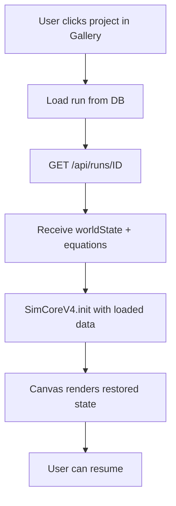

# Replay Rules
## Layer E — How to Restore & Replay

---

## 🔄 Restore Flow

---

## 📋 What Gets Restored

| Data | Source | Required |
|------|--------|----------|
| Particle positions | runs.worldState | ✅ Yes |
| Particle velocities | runs.worldState | ✅ Yes |
| Simulation time | runs.worldState | ✅ Yes |
| Step count | runs.worldState | ✅ Yes |
| Equation config | runs.equations | ✅ Yes |
| dt (time step) | runs.equations | ✅ Yes |
| Notes | notes table | No |
| Telemetry history | telemetry table | No |

---

## 🎯 Replay Guarantee

**Contract:**

To replay exactly:
1. ✅ Load worldState at step 0
2. ✅ Load same equations
3. ⚠️ Load same seed (not implemented)
4. ⚠️ Load same dt
5. Run step() N times
6. Should produce identical result

---

## ⚠️ Current Status

| Feature | Status |
|---------|--------|
| Restore worldState | ✅ Works |
| Restore equations | ✅ Works |
| Seed persistence | ✅ Implemented (runs.seed BigInt) |
| Exact replay (deterministic) | ⚠️ Needs verification |
| Telemetry replay | ❌ Not implemented |

---

## 📍 Missing for Full Replay

1. **Seed persistence** - Save RNG seed with run
2. **Initial conditions** - Save step 0 separately
3. **Parameter history** - Track param changes

---

## 🔒 Restore Validation

Before restoring:
1. Check worldState exists
2. Validate particle array
3. Validate equations exist
4. Show error if corrupt

---

**Layer:** E — Database/Persistence  
**Status:** 🔄 Partial implementation
