# SimCore V4 Spec
## Layer D — Equation-Agnostic Simulation Engine

**Version:** 4.0
**Last Updated:** 2025-12-25
**Status:** ✅ IMPLEMENTED

---

## 1. Core Principles

**"Registry Driven, Not Hardcoded"**

SimCore V4 is designed to be completely agnostic to the specific equations being simulated. Unlike V3, which had hardcoded presets, V4 receives a pure configuration object (`SimConfig`) and executes it.

*   **Data-Driven:** `init()` accepts a config object, not a string ID.
*   **Registry-Aware:** It trusts the `EquationRegistry` to handle physics logic.
*   **Unified:** Bridged to `presetRegistry` via `SimStore`.

---

## 2. The Configuration Contract: `SimConfig`

The engine is initialized with this strict structure:

```typescript
export interface SimConfig {
    presetId: string;
    
    // 1. Initial State (Bodies)
    // Generated by InitialStateGenerator or loaded from DB
    initialState: SimBody[];
    
    // 2. Equation Configuration
    // Which equations to enable and with what role
    equations: SimEnableConfig[];
    
    // 3. Simulation Parameters
    simParams: {
        dt?: number;
        speed?: number;
        softening?: number;
        [key: string]: any;
    };
    referenceHashes?: Record<number, string>; // step -> hash for ALGN-02
}

export interface SimEnableConfig {
    moduleId: string;
    role: 'driver' | 'observer' | 'coupled';
    params?: Record<string, number | string>;
    enabled: boolean;
}
```

---

## 3. Initialization Flow

```mermaid
sequenceDiagram
    participant Store as SimStore (Layer B)
    participant Reg as PresetRegistry
    participant Gen as BodyGenerator
    participant Core as SimCoreV4 (Layer D)
    participant Eq as EquationRegistry

    Store->>Reg: get(presetId)
    Reg-->>Store: SimPreset Parsing
    Store->>Gen: generate(initialState)
    Gen-->>Store: SimBody[]
    
    Note over Store: Construct SimConfig
    
    Store->>Core: init(SimConfig)
    
    rect rgb(20, 20, 20)
        Note over Core: 1. Hydrate Registries
        Note over Core: 2. Reset WorldState
        Note over Core: 3. Disable all Equations (Clean Slate)
        Core->>Eq: enable(moduleId, role)
        Core->>Eq: setParams(params)
        Core->>Eq: initialize()
    end
    
    Core-->>Store: Ready
```



---

## 4. Key Methods

| Method | Description |
|:---|:---|
| `init(config: SimConfig)` | **Primary Entry Point.** Replaces old `setPreset`. |
| `step()` | Advances simulation by `dt`. |
| `getTelemetry()` | Returns unified telemetry (including Health G0-G5). |
| `enableEquation(id, role)` | Runtime dynamic enabling. |
| `play() / pause()` | Loop control. |
| `getStateHash()` | Generates cryptographic fingerprint of state. |
| `calculateDeterminismDrift()` | Logic for ERR_D5 check. |

---

## 5. Migration from V3

*   ❌ `setPreset(string)` is **REMOVED**.
*   ❌ `PRESETS` constant is **REMOVED**.
*   ✅ Use `SimStore.init(presetId)` which handles the mapping.

---
