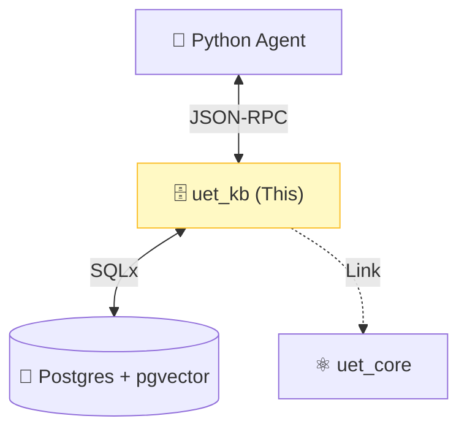

# 🗄️ UET Knowledge Base (`uet_kb`)


> **"The Brain of UET"** - Server ที่ทำหน้าที่เก็บความรู้ (Memory) และให้บริการค้นหา (Search) แก่ Agent อื่นๆ ผ่าน MCP Protocol.

---

## 🏛️ Architecture Pillars

| Component | Description |
| :--- | :--- |
| **MCP Server** | Implement JSON-RPC 2.0 ให้ Agent (Python) เรียกใช้ Tools ได้. |
| **Vector DB** | จัดการการเก็บและค้นหา Vector (Semantic + Physics Embedding). |
| **API** | ให้บริการคำสั่ง `ingest`, `search`, `delete` แบบ Real-time. |

---

## 🔗 System Connection



---

## 🛠️ Available MCP Tools

| Tool Name | Description |
| :--- | :--- |
| `search_knowledge_base` | ค้นหาข้อมูลด้วย Vector Search (Semantic). |
| `search_physics` | ค้นหาด้วยค่าฟิสิกส์ (UET Physics Vector). |
| `ingest_document` | เพิ่ม/แก้ไข เอกสารเข้าสู่ระบบ. |
| `delete_document` | ลบเอกสารออกจากระบบ. |
| `list_topics` | ดูรายชื่อหัวข้อทั้งหมดในระบบ. |

---

## 🚀 Quick Start (Dev Mode)

```bash
# รัน server (ฟังทาง Stdin)
cargo run --bin uet_kb
```
